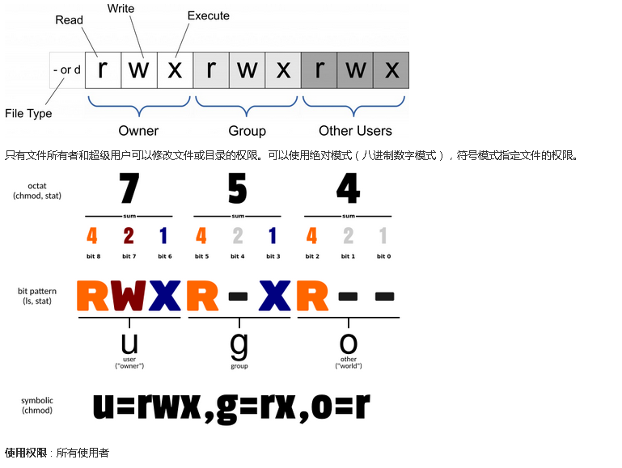

[TOC]

------


##  1. 文件管理类

### 1.1 cat

cat（英文全拼：concatenate）命令用于连接文件并打印到标准输出设备上。

#### 使用权限

所有使用者

#### 语法格式

```shell
cat [-AbeEnstTuv] [--help] [--version] fileName
```
#### 参数说明：

**-n 或 --number**：由 1 开始对所有输出的行数编号。
**-b 或 --number-nonblank**：和 -n 相似，只不过对于空白行不编号。
**-s 或 --squeeze-blank**：当遇到有连续两行以上的空白行，就代换为一行的空白行。
**-v 或 --show-nonprinting**：使用 ^ 和 M- 符号，除了 LFD 和 TAB 之外。
**-E 或 --show-ends** : 在每行结束处显示 $。
**-T 或 --show-tabs**: 将 TAB 字符显示为 ^I。
**-A, --show-all**：等价于 -vET。
**-e：**等价于"-vE"选项；
**-t：**等价于"-vT"选项；

#### 实例：

- 把 textfile1 的文档内容加上行号后输入 textfile2 这个文档里：
```shell
cat -n textfile1 > textfile2
```
-  把 textfile1 和 textfile2 的文档内容加上行号（空白行不加）之后将内容附加到 textfile3 文档里：
```shell
cat -b textfile1 textfile2 >> textfile3
```
- 清空 /etc/test.txt 文档内容：
```shell
cat /dev/null > /etc/test.txt
```
- cat 也可以用来制作镜像文件。例如要制作软盘的镜像文件，将软盘放好后输入：
```shell
cat /dev/fd0 > OUTFILE
```
- 相反的，如果想把 image file 写到软盘，输入：
```shell
cat IMG_FILE > /dev/fd0
```
**注**：

- 1. OUTFILE 指输出的镜像文件名。
- 2. IMG_FILE 指镜像文件。
- 3. 若从镜像文件写回 device 时，device 容量需与相当。
- 4. 通常用制作开机磁片。

### 1.2 chattr

Linux chattr命令用于改变文件属性。
这项指令可改变存放在ext2文件系统上的文件或目录属性，这些属性共有以下8种模式：

1. **a：让文件或目录仅供附加用途。**     适用于日志文件
2. b：不更新文件或目录的最后存取时间。
3. c：将文件或目录压缩后存放。
4. d：将文件或目录排除在倾倒操作之外。
5. **i：不得任意更动文件或目录。**
6. s：保密性删除文件或目录。
7. S：即时更新文件或目录。
8. u：预防意外删除。

#### 语法

```shell
chattr [-RV][-v<版本编号>][+/-/=<属性>][文件或目录...]
```

#### 参数

```shell
-R  递归处理，将指定目录下的所有文件及子目录一并处理。
-v<版本编号>  设置文件或目录版本。
-V  显示指令执行过程。
+<属性>  开启文件或目录的该项属性。
-<属性>  关闭文件或目录的该项属性。
=<属性>  指定文件或目录的该项属性。
```

#### 实例

用chattr命令防止系统中某个关键文件被修改：
```shell
chattr +i /etc/resolv.conf
lsattr /etc/resolv.conf
```
会显示如下属性
```shell
----i-------- /etc/resolv.conf
```
让某个文件只能往里面追加数据，但不能删除，适用于各种日志文件：
```shell
chattr +a /var/log/messages
```

### 1.3 chgroup

用于改变文件或文件夹所属的群组，允许普通用户改变问价所属的组，只需要该用户是该组的成员。

#### 语法

```shell
chgrp [-cfhRv][--help][--version][所属群组][文件或目录...] 或 chgrp [-cfhRv][--help][--reference=<参考文件或目录>][--version][文件或目录...]
```

#### 参数说明

```shell
-c或--changes 效果类似"-v"参数，但仅回报更改的部分。
-f或--quiet或--silent 　不显示错误信息。
-h或--no-dereference 　只对符号连接的文件作修改，而不更动其他任何相关文件。
-R或--recursive 　递归处理，将指定目录下的所有文件及子目录一并处理。
-v或--verbose 　显示指令执行过程。
--help 　在线帮助。
--reference=<参考文件或目录> 　把指定文件或目录的所属群组全部设成和参考文件或目录的所属群组相同。
--version 　显示版本信息
```

#### 实例

- 实例1：改变文件的群组属性：

```shell
[root@localhost test]# ll
---xrw-r-- 1 root root 302108 11-13 06:03 log2012.log
[root@localhost test]# chgrp -v bin log2012.log
##  log2012.log 的所属组已更改为 bin
[root@localhost test]# ll
---xrw-r-- 1 root bin  302108 11-13 06:03 log2012.log
```

- 实例2：根据指定文件改变文件的群组属性 

```shell
[root@localhost test]# ll
---xrw-r-- 1 root bin  302108 11-13 06:03 log2012.log
-rw-r--r-- 1 root root     61 11-13 06:03 log2013.log
[root@localhost test]#  chgrp --reference=log2012.log log2013.log 
[root@localhost test]# ll
---xrw-r-- 1 root bin  302108 11-13 06:03 log2012.log
-rw-r--r-- 1 root bin      61 11-13 06:03 log2013.log
```

### 1.4 chmod

控制用户对文件的权限



#### 语法

```shell
chmod [-cfvR] [--help] [--version] mode file...
```

#### 参数说明

mode : 权限设定字串，格式如下 :

```shell
[ugoa...][[+-=][rwxX]...][,...]
```

其中：

- u 表示该文件的拥有者，g 表示与该文件的拥有者属于同一个群体(group)者，o 表示其他以外的人，a 表示这三者皆是。
- \+ 表示增加权限、- 表示取消权限、= 表示唯一设定权限。
- r 表示可读取，w 表示可写入，x 表示可执行，X 表示只有当该文件是个子目录或者该文件已经被设定过为可执行。

其他参数说明：

```shell
-c : 若该文件权限确实已经更改，才显示其更改动作
-f : 若该文件权限无法被更改也不要显示错误讯息
-v : 显示权限变更的详细资料
-R : 对目前目录下的所有文件与子目录进行相同的权限变更(即以递归的方式逐个变更)
--help : 显示辅助说明
--version : 显示版本
```

#### 符号模式

使用符号模式可以设置多个项目：who（用户类型），operator（操作符）和  permission（权限），每个项目的设置可以用逗号隔开。 命令 chmod 将修改 who  指定的用户类型对文件的访问权限，用户类型由一个或者多个字母在 who 的位置来说明，如 who 的符号模式表所示:

| who  | 用户类型 | 说明                   |
| ---- | -------- | ---------------------- |
| `u`  | user     | 文件所有者             |
| `g`  | group    | 文件所有者所在组       |
| `o`  | others   | 所有其他用户           |
| `a`  | all      | 所用用户, 相当于 *ugo* |

operator 的符号模式表:

| Operator | 说明                                                   |
| -------- | ------------------------------------------------------ |
| `+`      | 为指定的用户类型增加权限                               |
| `-`      | 去除指定用户类型的权限                                 |
| `=`      | 设置指定用户权限的设置，即将用户类型的所有权限重新设置 |

permission 的符号模式表:

| 模式 | 名字         | 说明                                                         |
| ---- | ------------ | ------------------------------------------------------------ |
| `r`  | 读           | 设置为可读权限                                               |
| `w`  | 写           | 设置为可写权限                                               |
| `x`  | 执行权限     | 设置为可执行权限                                             |
| `X`  | 特殊执行权限 | 只有当文件为目录文件，或者其他类型的用户有可执行权限时，才将文件权限设置可执行 |
| `s`  | setuid/gid   | 当文件被执行时，根据who参数指定的用户类型设置文件的setuid或者setgid权限 |
| `t`  | 粘贴位       | 设置粘贴位，只有超级用户可以设置该位，只有文件所有者u可以使用该位 |

#### 八进制语法

chmod命令可以使用八进制数来指定权限。文件或目录的权限位是由9个权限位来控制，每三位为一组，它们分别是文件所有者（User）的读、写、执行，用户组（Group）的读、写、执行以及其它用户（Other）的读、写、执行。历史上，文件权限被放在一个比特掩码中，掩码中指定的比特位设为1，用来说明一个类具有相应的优先级。

| #    | 权限           | rwx  | 二进制 |
| ---- | -------------- | ---- | ------ |
| 7    | 读 + 写 + 执行 | rwx  | 111    |
| 6    | 读 + 写        | rw-  | 110    |
| 5    | 读 + 执行      | r-x  | 101    |
| 4    | 只读           | r--  | 100    |
| 3    | 写 + 执行      | -wx  | 011    |
| 2    | 只写           | -w-  | 010    |
| 1    | 只执行         | --x  | 001    |
| 0    | 无             | ---  | 000    |

例如， 765 将这样解释：

- 所有者的权限用数字表达：属主的那三个权限位的数字加起来的总和。如 rwx ，也就是 4+2+1 ，应该是 7。
- 用户组的权限用数字表达：属组的那个权限位数字的相加的总和。如 rw- ，也就是 4+2+0 ，应该是 6。
- 其它用户的权限数字表达：其它用户权限位的数字相加的总和。如 r-x ，也就是 4+0+1 ，应该是 5。

#### 实例

- 将文件 file1.txt 设为所有人皆可读取 :

```shell
chmod ugo+r file1.txt
```

- 将文件 file1.txt 设为所有人皆可读取 :

```
chmod a+r file1.txt
```

- 将文件 file1.txt 与 file2.txt 设为该文件拥有者，与其所属同一个群体者可写入，但其他以外的人则不可写入 :

```
chmod ug+w,o-w file1.txt file2.txt
```

- 将 ex1.py 设定为只有该文件拥有者可以执行 :

```
chmod u+x ex1.py
```

- 将目前目录下的所有文件与子目录皆设为任何人可读取 :

```
chmod -R a+r *
```

- 此外chmod也可以用数字来表示权限如 :

```
chmod 777 file
```

 r=4，w=2，x=1

- 若要 rwx 属性则 4+2+1=7；
- 若要 rw- 属性则 4+2=6；
- 若要 r-x 属性则 4+1=5。

```
chmod a=rwx file
```

和

```
chmod 777 file
```

效果相同

```
chmod ug=rwx,o=x file
```

和

```
chmod 771 file
```

效果相同

若用 chmod 4755 filename 可使此程序具有 root 的权限。

#### 更多说明

| `命令`                                     | 说明                                                         |
| ------------------------------------------ | ------------------------------------------------------------ |
| `chmod a+r *file*`                         | 给file的所有用户增加读权限                                   |
| `chmod a-x *file*`                         | 删除file的所有用户的执行权限                                 |
| `chmod a+rw *file*`                        | 给file的所有用户增加读写权限                                 |
| `chmod +rwx *file*`                        | 给file的所有用户增加读写执行权限                             |
| `chmod u=rw,go=  *file*`                   | 对file的所有者设置读写权限，清空该用户组和其他用户对file的所有权限（空格代表无权限） |
| `chmod -R u+r,go-r *docs*`                 | 对目录docs和其子目录层次结构中的所有文件给用户增加读权限，而对用户组和其他用户删除读权限 |
| `chmod 664 *file*`                         | 对file的所有者和用户组设置读写权限, 为其其他用户设置读权限   |
| `chmod 0755 *file*`                        | 相当于`u=rwx (4+2+1),go=rx (4+1 & 4+1)`。`0` 没有特殊模式。  |
| `chmod 4755 *file*`                        | `4`设置了设置[用户ID](https://www.runoob.com/wiki/用户ID)位，剩下的相当于 u=rwx (4+2+1),go=rx (4+1 & 4+1)。 |
| `find path/ -type d -exec chmod a-x {} \;` | 删除可执行权限对path/以及其所有的目录（不包括文件）的所有用户，使用'-type f'匹配文件 |
| `find path/ -type d -exec chmod a+x {} \;` | 允许所有用户浏览或通过目录path/                              |

### 1.5 chown

​		设置文件所有者和文件关联组的命令。

### 1.6 cksum

​		检查文件的crc是否正确，确保问价从一个系统传输到另一个系统的过程中不被破坏，它是一种拍错检查方式，可以检测到99.998%的已知错误。

#### 实例

- 使用指令"cksum"计算文件"testfile1"的完整性，输入如下命令：

```shell
$ cksum testfile1       
```

以上命令执行后，将输出校验码等相关的信息，具体输出信息如下所示：

```shell
1263453430 78 testfile1         //输出信息 
```

上面的输出信息中，"1263453430"表示校验码，"78"表示字节数。

**注意：**如果文件中有任何字符被修改，都将改变计算后CRC校验码的值。

### 1.7 cmp

​		比较两个文件是否相同，当两个文件完全一样时，不会有任何信息，如果存在差异，则显示第一个不同的位置。

### 1.8 diff

以逐行的方式，比较两个文本文件的异同

#### 参数

```shell
-B或--ignore-blank-lines 　不检查空白行。
-c 　显示全部内文，并标出不同之处。
-C<行数>或--context<行数> 　与执行"-c-<行数>"指令相同。
-d或--minimal 　使用不同的演算法，以较小的单位来做比较。
-D<巨集名称>或ifdef<巨集名称> 　此参数的输出格式可用于前置处理器巨集。
-e或--ed 　此参数的输出格式可用于ed的script文件。
-f或-forward-ed 　输出的格式类似ed的script文件，但按照原来文件的顺序来显示不同处。
-H或--speed-large-files 　比较大文件时，可加快速度。
-l<字符或字符串>或--ignore-matching-lines<字符或字符串> 　若两个文件在某几行有所不同，而这几行同时都包含了选项中指定的字符或字符串，则不显示这两个文件的差异。
-i或--ignore-case 　不检查大小写的不同。
-l或--paginate 　将结果交由pr程序来分页。
-n或--rcs 　将比较结果以RCS的格式来显示。
-N或--new-file 　在比较目录时，若文件A仅出现在某个目录中，预设会显示：
Only in目录：文件A若使用-N参数，则diff会将文件A与一个空白的文件比较。
-p 　若比较的文件为C语言的程序码文件时，显示差异所在的函数名称。
-P或--unidirectional-new-file 　与-N类似，但只有当第二个目录包含了一个第一个目录所没有的文件时，才会将这个文件与空白的文件做比较。
-q或--brief 　仅显示有无差异，不显示详细的信息。
-r或--recursive 　比较子目录中的文件。
-s或--report-identical-files 　若没有发现任何差异，仍然显示信息。
-S<文件>或--starting-file<文件> 　在比较目录时，从指定的文件开始比较。
-t或--expand-tabs 　在输出时，将tab字符展开。
-T或--initial-tab 　在每行前面加上tab字符以便对齐。
-u,-U<列数>或--unified=<列数> 　以合并的方式来显示文件内容的不同。
-v或--version 　显示版本信息。
-w或--ignore-all-space 　忽略全部的空格字符。
-W<宽度>或--width<宽度> 　在使用-y参数时，指定栏宽。
-x<文件名或目录>或--exclude<文件名或目录> 　不比较选项中所指定的文件或目录。
-X<文件>或--exclude-from<文件> 　您可以将文件或目录类型存成文本文件，然后在=<文件>中指定此文本文件。
-y或--side-by-side 　以并列的方式显示文件的异同之处。
--help 　显示帮助。
--left-column 　在使用-y参数时，若两个文件某一行内容相同，则仅在左侧的栏位显示该行内容。
--suppress-common-lines 　在使用-y参数时，仅显示不同之处。
```

#### 实例

- 比较两个文件的异同，并排输出

```shell
[root@localhost test3]# diff log2014.log log2013.log  -y -W 50
2013-01                 2013-01
2013-02                 2013-02
2014-03               | 2013-03
2013-04                 2013-04
2013-05                 2013-05
2013-06                 2013-06
2013-07                 2013-07
2013-07               | 2013-08
2013-09                 2013-09
2013-10                 2013-10
2013-11               <
2013-12               <
[root@localhost test3]# diff log2013.log log2014.log  -y -W 50
2013-01                 2013-01
2013-02                 2013-02
2013-03               | 2014-03
2013-04                 2013-04
2013-05                 2013-05
2013-06                 2013-06
2013-07                 2013-07
2013-08               | 2013-07
2013-09                 2013-09
2013-10                 2013-10
                      > 2013-11
                      > 2013-12
```

### 1.9 file

​		查看文件的类型

#### 实例

```shell
[root@localhost ~]# file install.log
install.log: UTF-8 Unicode text

[root@localhost ~]# file -b install.log      <== 不显示文件名称
UTF-8 Unicode text

[root@localhost ~]# file -i install.log      <== 显示MIME类别。
install.log: text/plain; charset=utf-8

[root@localhost ~]# file -b -i install.log
text/plain; charset=utf-8
```

### 1.10 find

在指定目录下查找文件

#### 实例

- 将目前目录及其子目录下所有延伸档名是 c 的文件列出来。

```shell
# find . -name "*.c"
```

- 将目前目录其其下子目录中所有一般文件列出

```shell
# find . -type f
```

- 将目前目录及其子目录下所有最近 20 天内更新过的文件列出

```shell
# find . -ctime -20
```

- 查找/var/log目录中更改时间在7日以前的普通文件，并在删除之前询问它们：

```shell
# find /var/log -type f -mtime +7 -ok rm {} \;
```

- 查找前目录中文件属主具有读、写权限，并且文件所属组的用户和其他用户具有读权限的文件：

```shell
# find . -type f -perm 644 -exec ls -l {} \;
```

- 为了查找系统中所有文件长度为0的普通文件，并列出它们的完整路径：

```shell
# find / -type f -size 0 -exec ls -l {} \;
```

### 1.11 mv

文件或目录的重命名或移动

#### 参数说明

```shell
-b: 当目标文件或目ll录存在时，在执行覆盖前，会为其创建一个备份。
-i: 如果指定移动的源目录或文件与目标的目录或文件同名，则会先询问是否覆盖旧文件，输入 y 表示直接覆盖，输入 n 表示取消该操作。
-f: 如果指定移动的源目录或文件与目标的目录或文件同名，不会询问，直接覆盖旧文件。
-n: 不要覆盖任何已存在的文件或目录。
-u：当源文件比目标文件新或者目标文件不存在时，才执行移动操作。
```

### 1.12 rm

命令用于删除一个文件或者目录。

#### 语法

```shell
rm [options] name...
```

#### **参数**：

- -i 删除前逐一询问确认。
- -f 即使原档案属性设为唯读，亦直接删除，无需逐一确认。
- -r 将目录及以下之档案亦逐一删除。

#### 实例

- 删除文件可以直接使用rm命令，若删除目录则必须配合选项"-r"，例如：

```shell
# rm  test.txt 
rm：是否删除 一般文件 "test.txt"? y  
# rm  homework  
rm: 无法删除目录"homework": 是一个目录  
# rm  -r  homework  
rm：是否删除 目录 "homework"? y 
```

- 删除当前目录下的所有文件及目录，命令行为：

```shell
rm  -r  * 
```

- 删除当前目录下的所有文件及目录，并且是直接删除，无需逐一确认命令行为：

```shell
rm  -rf  要删除的文件名或目录
```

- 删除文件名 test.txt:

```shell
rm  -rf   test.txt
```

- 删除目录 test，不管该目录下是否有子目录或文件，都直接删除:

```shell
rm  -rf   test/
```

### 1.13 touch

用于修改文件或者目录的时间属性，包括存取时间和更改时间。若文件不存在，系统会建立一个新的文件。

 ls -l 可以显示档案的时间记录。

#### 语法

```shell
touch [-acfm][-d<日期时间>][-r<参考文件或目录>] [-t<日期时间>][--help][--version][文件或目录…]
```

#### **参数说明**

- a 改变档案的读取时间记录。
- m 改变档案的修改时间记录。
- c 假如目的档案不存在，不会建立新的档案。与 --no-create 的效果一样。
- f 不使用，是为了与其他 unix 系统的相容性而保留。
- r 使用参考档的时间记录，与 --file 的效果一样。
- d 设定时间与日期，可以使用各种不同的格式。
- t 设定档案的时间记录，格式与 date 指令相同。
- --no-create 不会建立新档案。
- --help 列出指令格式。
- --version 列出版本讯息。

#### 实例

使用指令"touch"修改文件"testfile"的时间属性为当前系统时间，输入如下命令：

```shell
$ touch testfile                #修改文件的时间属性 
```

首先，使用ls命令查看testfile文件的属性，如下所示：

```shell
$ ls -l testfile                #查看文件的时间属性  
#原来文件的修改时间为16:09  
-rw-r--r-- 1 hdd hdd 55 2011-08-22 16:09 testfile  
```

执行指令"touch"修改文件属性以后，并再次查看该文件的时间属性，如下所示：

```shell
$ touch testfile                #修改文件时间属性为当前系统时间  
$ ls -l testfile                #查看文件的时间属性  
#修改后文件的时间属性为当前系统时间  
-rw-r--r-- 1 hdd hdd 55 2011-08-22 19:53 testfile  
```

使用指令"touch"时，如果指定的文件不存在，则将创建一个新的空白文件。例如，在当前目录下，使用该指令创建一个空白文件"file"，输入如下命令：

```shell
$ touch file            #创建一个名为“file”的新的空白文件 


```


