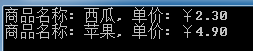

[TOC]

------


## 一、知识点提要

### 1. Attributes特性

​		模拟一个ASP.NET MVC经常要用到的StringLenth特性，它用于判断用户输入是否超出长度限制。我们现在来模拟它。先定义一个MyStringLenth特性：

```c#
// 用户自定义的带有可选命名参数的 MyStringLenthAttribute 特性类。
// 该特性通过AttributeUsage限制它只能用在属性和字段上。
[AttributeUsage(AttributeTargets.Property | AttributeTargets.Field)]
public sealed class MyStringLenthAttribute : Attribute {
    public MyStringLenthAttribute(string displayName, int maxLength) {
        this.MaxLength = maxLength;
        this.DisplayName = displayName;
    }
    //显示的名称，对外是只读的，所以不能通过可选参数来赋值，必须在构造函数中对其初始化。
    public string DisplayName { get; private set; }

    //长度最大值，对外是只读的，所以不能通过可选参数来赋值，必须在构造函数中对其初始化。
    public int MaxLength { get; private set; }

    //错误信息，标注时可作为可选命名参数来使用。
    public string ErrorMessage { get; set; }

    //长度最小值，标注时可作为可选命名参数来使用。
    public int MinLength { get; set; }
}
```

​		上面若不加AttributeUsage限制，特性可以声明在类型（如结构、类、枚举、委托）和成员（如方法，字段，事件，属性，索引）的前面。

​		然后我们把这个特性应用在下面的Order类之上：

```c#
// 应用自定义MyStringLenth特性于Order类的OrderID属性之上。MinLength和ErrorMessage是命名参数。
public class Order {
    [MyStringLenth("订单号", 6,MinLength = 3, ErrorMessage = "{0}的长度必须在{1}和{2}之间，请重新输入！")]
    public string OrderID { get; set; }
}
```

​		如何使用MyStringLenth特性验证用户输入字符串的长度：

```c#
//检查成员字符串长度是否越限。
private static bool IsMemberValid(int inputLength, MemberInfo member) {
    foreach (object attribute in member.GetCustomAttributes(true)) {
        if (attribute is MyStringLenthAttribute) {
            MyStringLenthAttribute attr=(MyStringLenthAttribute)attribute;
            string displayName = attr.DisplayName;
            int maxLength = attr.MaxLength;
            int minLength = attr.MinLength;
            string msg = attr.ErrorMessage;

            if (inputLength < minLength || inputLength > maxLength) {
                Console.WriteLine(msg, displayName, minLength, maxLength);
                return false;
            }
            else {
                return true;
            }
        }
    }
    return false;
}
//验证输入是否合法
private static bool IsValid(Order order) {
    if (order == null) return false;

    foreach (PropertyInfo p in typeof(Order).GetProperties()) {
        if (IsMemberValid(order.OrderID.Length, p))
            return true;
    }
    return false;
}
public static void Main() {
    string input=string.Empty;
    Order order;
    do {
        Console.WriteLine("请输入订单号：");
        input = Console.ReadLine();
        order = new Order { OrderID = input };
    }
    while (!IsValid(order));
    Console.WriteLine("订单号输入正确，按任意键退出！");
    Console.ReadKey();
}
```

### 2. 自动属性

​	当属性的get和set没有特殊的需求时，使用自动属性可以使代码更加简洁

```c#
//自动实现的属性
public string Name { get; set; }
//自动属性也可以有不同的访问权限
public string Name { get;private set; }
```

注意：get和set要同时提供，不能只提供get或set，编译报错

### 3. 对象集合的初始化器

```c#
tatic void Main(string[] args) {
    //对象初始化器的使用 （可只给部分字段赋值）
    Product product = new Product { ProductID = 1234, Name = "西瓜", Price = 2.3M };//创建并初始化一个实例

    //集合初始化器的使用
    List<Product> proList = new List<Product> { 
        new Product { ProductID = 1234, Name = "西瓜", Price = 2.3M },
        new Product { ProductID = 2345, Name = "苹果", Price = 5.9M  },
        new Product { ProductID = 3456, Name = "樱桃", Price = 4.6M }
    };
    //打印
    Console.WriteLine("对象初始化器：{0} {1} {2}", product.ProductID, product.Name, product.Price);
    foreach (Product p in proList) {
        Console.WriteLine("集合初始化器：{0} {1} {2}", p.ProductID, p.Name, p.Price);
    }
    Console.ReadKey();
}

//数组使用初始化器
string[] fruitArray = {"apple","orange","plum" };
//匿名类型使用初始化器
var books = new { Title = "ASP.NET MVC 入门", Author = "小王", Price = 20 };
//字典类型使用初始化器
Dictionary<string, int> fruitDic = new Dictionary<string, int>() { 
    { "apple", 10 },
    { "orange", 20 },
    { "plum", 30 }
};
```

### 4. 扩展方法

扩展方法使您能够向现有类型“添加”方法，而无需创建新的派生类型或修改原始类型。扩展方法是一种特殊的静态方法，但可以像扩展类型上的实例方法一样进行调用。例如，我们可以让Random类的所有实例对象拥有一个返回随机bool值的方法。我们不能对Random类本身进行修改，但可以对它进行扩展，如下代码所示：

```C#
static class Program {
    /// <summary>
    /// 随机返回 true 或 false
    /// </summary>
    /// <param name="random">this参数自动指定到Random的实例</param>
    /// <returns></returns>
    public static bool NextBool(this Random random) {
        return random.NextDouble() > 0.5;
    }

    static void Main(string[] args) {
        //调用扩展方法
        Random rd = new Random();
        bool bl = rd.NextBool();

        Console.WriteLine(bl.ToString());
        Console.ReadKey();
    }
}
```

注意，扩展方法必须在非泛型的静态类中定义，上面的Program类如不加static修饰符则会报错。

我们可以创建一个接口的扩展方法，这样实现该接口的类都可以调用该扩展方法。看下面一个完整示例：

```C#
/// <summary>
/// 购物车类 （实现 IEnumerable<Product> 接口）
/// </summary>
public class ShoppingCart : IEnumerable<Product> {
    public List<Product> Products { get; set; }
    public IEnumerator<Product> GetEnumerator() {
        return Products.GetEnumerator();
    }
    IEnumerator IEnumerable.GetEnumerator() {
        return GetEnumerator();
    }
}

/// <summary>
/// 定义一个静态类，用于实现扩展方法（注意：扩展方法必须定义在静态类中）
/// </summary>
public static class MyExtensionMethods {
    /// <summary>
    /// 计算商品总价钱
    /// </summary>
    public static decimal TotalPrices(this IEnumerable<Product> productEnum) {
        decimal total = 0;
        foreach (Product prod in productEnum) {
            total += prod.Price;
        }
        return total;
    }
}

class Program {
    static void Main(string[] args) {
        // 创建并初始化ShoppingCart实例，注入IEnumerable<Product>
        IEnumerable<Product> products = new ShoppingCart {
            Products = new List<Product> { 
                new Product {Name = "Kayak", Price = 275}, 
                new Product {Name = "Lifejacket", Price = 48.95M}, 
                new Product {Name = "Soccer ball", Price = 19.50M}, 
                new Product {Name = "Corner flag", Price = 34.95M}
            }
        };
        // 创建并初始化一个普通的Product数组
        Product[] productArray = { 
            new Product {Name = "Kayak", Price = 275M}, 
            new Product {Name = "Lifejacket", Price = 48.95M}, 
            new Product {Name = "Soccer ball", Price = 19.50M}, 
            new Product {Name = "Corner flag", Price = 34.95M} 
        };

        // 取得商品总价钱：用接口的方式调用TotalPrices扩展方法。
        decimal cartTotal = products.TotalPrices();
        // 取得商品总价钱：用普通数组的方式调用TotalPrices扩展方法。
        decimal arrayTotal = productArray.TotalPrices();

        Console.WriteLine("Cart Total: {0:c}", cartTotal);
        Console.WriteLine("Array Total: {0:c}", arrayTotal);
        Console.ReadKey();
    }
```

### 5.Lambda 表达式

​		Lambda 表达式和匿名函数其实是一件事情。不同是，他们语法表现形式不同，Lambda  表达式在语法上实际上就是匿名函数的简写。直接介绍匿名函数和Lambda表达式的用法没什么意思，在这里，我要根据实际应用来讲一个两者用法的例子，这样在介绍知识点的同时也能和大家分享一下解决问题的思想。

​		假如我们要实现一个功能强大的商品查询方法，这个商品查询方法如何查询商品是可以由用户自己来决定的，用户可以根据价格来查询商品，也可以根据分类来查询商品等等，也就是说用户可以把自己的查询逻辑传递给这个查询方法。要编写这样一个方法，我们很自然的会想到用一个委托来作为这个方法的参数，这个委托就是用户处理商品查询的逻辑。 我们不防把这个查询方法称为“商品查询器”。我们可以用静态的扩展方法来实现这个“商品查询器“，这样每个商品集合对象（如  IEnumerable<Product>  products)可以直接调用该静态方法返回查询结果。解决问题的思想有了，接下来就是实现了。或许你对这一段描述有点蒙，结合代码可能让你更清晰。下面是这个“商品查询器”-Filter方法的实现代码：

```c#
/// <summary>
/// 定义一个静态类，用于实现扩展方法
/// </summary>
public static class MyExtensionMethods {
    /// <summary>
    /// 商品查询器
    /// </summary>
    /// <param name="productEnum">扩展类型的实例引用</param>
    /// <param name="selectorParam">一个参数类型为Product，返回值为bool的委托</param>
    /// <returns>查询结果</returns>
    public static IEnumerable<Product> Filter(this IEnumerable<Product> productEnum, Func<Product, bool> selectorParam) {
        foreach (Product prod in productEnum) {
            if (selectorParam(prod)) {
                yield return prod;
            }
        }
    }
}
```

​		没错，我们就是用这么简短的Filter方法来满足各种需求的查询。上面Product类使用的是前文定义的。这里也再一次见证了扩展方法的功效。为了演示Filter查询方法的调用，我们先来造一批数据：

```C#
static void Main(string[] args) {
    // 创建商品集合
    IEnumerable<Product> products = new ShoppingCart {
        Products = new List<Product> { 
            new Product {Name = "西瓜", Category = "水果", Price = 2.3M}, 
            new Product {Name = "苹果", Category = "水果", Price = 4.9M}, 
            new Product {Name = "ASP.NET MCV 入门", Category = "书籍", Price = 19.5M}, 
            new Product {Name = "ASP.NET MCV 提高", Category = "书籍", Price = 34.9M} 
        }
    };
}
```

​	接下来我们继续在上面Main方法中来调用查询方法Filter：

```C#
//用匿名函数定义一个具体的查询需求
Func<Product, bool> fruitFilter = delegate(Product prod) {
    return prod.Category == "水果";
};

//调用Filter，查询分类为“水果”的商品
IEnumerable<Product> filteredProducts = products.Filter(fruitFilter);

//打印结果
foreach (Product prod in filteredProducts) {
    Console.WriteLine("商品名称: {0}, 单价: {1:c}", prod.Name, prod.Price);
} 
Console.ReadKey();
```

输出结果为：


​		上面我们使用的是委托和匿名函数来处理用户查询逻辑，并把它传递给Filter方法，满足了前面所说的需求。但若使用Lambda表达式代替上面的匿名函数能使上面的代码看上去更简洁更人性化，如下代码所示：

```c#
Func<Product, bool> fruitFilter = prod => prod.Category == "水果";
IEnumerable<Product> filteredProducts = products.Filter(fruitFilter);
```

​		没有了delegate关键字，没有了大小括号，看上去更舒服。当然上面两行代码可以继续简化为一行：

```C#
IEnumerable<Product> filteredProducts = products.Filter(prod => prod.Category == "水果");
```

​		这三种方式输出结果都是一样的。然后，我们还可以通过Lambda表达式实现各种需求的查询：

```C#
//查询分类为“水果”或者单价大于30元的商品
IEnumerable<Product> filteredProducts = products.Filter(prod =>
    prod.Category == "水果" || prod.Price > 30
);
```

​		通过这个示例，相信大家已经清晰的了解并撑握了Lambda表达式的简单应用，而这就足够了。

### Entity Franework

给出两个 非空 的链表用来表示两个非负的整数。其中，它们各自的位数是按照 逆序 的方式存储的，并且它们的每个节点只能存储 一位 数字。

如果，我们将这两个数相加起来，则会返回一个新的链表来表示它们的和。

您可以假设除了数字 0 之外，这两个数都不会以 0 开头。

示例：

输入：(2 -> 4 -> 3) + (5 -> 6 -> 4)
输出：7 -> 0 -> 8
原因：342 + 465 = 807

​	

```java
/**
 * Definition for singly-linked list.
 * public class ListNode {
 *     int val;
 *     ListNode next;
 *     ListNode() {}
 *     ListNode(int val) { this.val = val; }
 *     ListNode(int val, ListNode next) { this.val = val; this.next = next; }
 * }
 */
class Solution {
    public ListNode addTwoNumbers(ListNode l1, ListNode l2) {
       int sum  = 0;
       int i =  0；
       while (l1.next!=null){
           sum+=li.val()*Math.pow(10,i++);
           l1 = li.next()
       }
       i = 0;
       while (l2.next!=null){    
          sum+=l2.val()*Math.pow(10,i++);
          l2 = l2.next()
       }
    }
}
```

​		

​		

​		

​		

​		

​		


