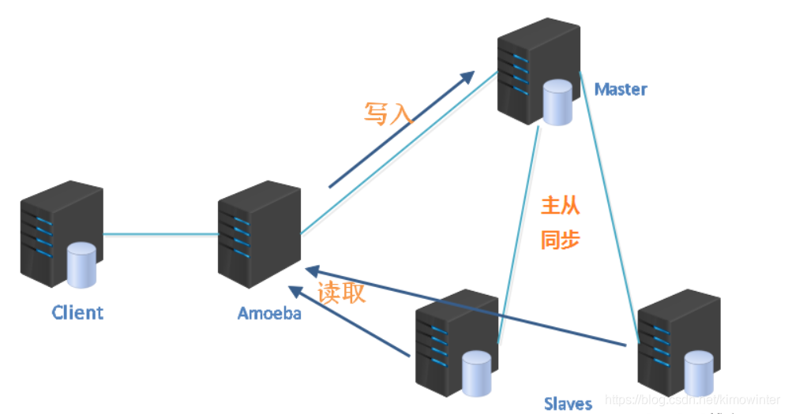
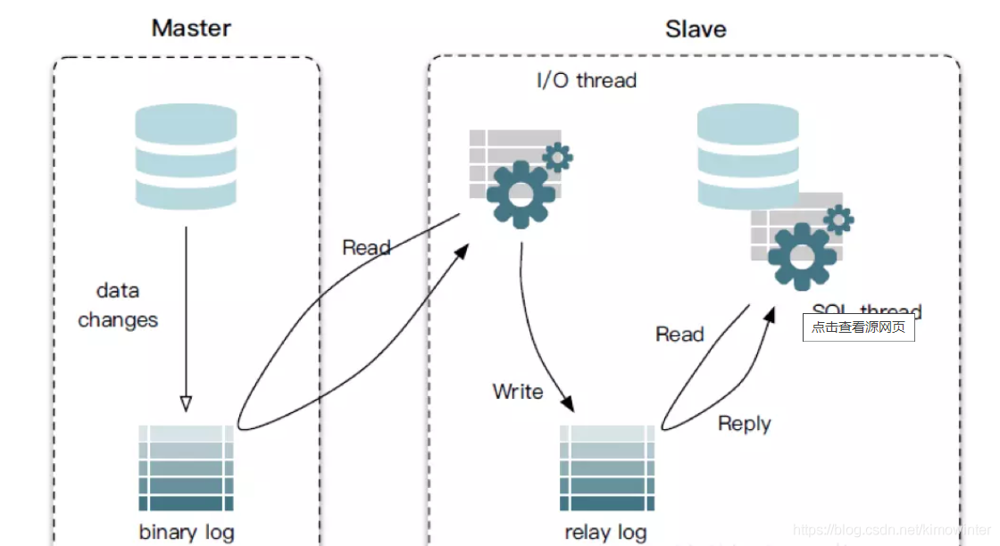
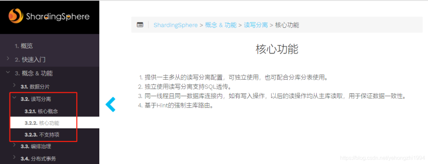
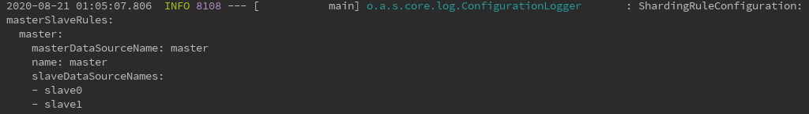
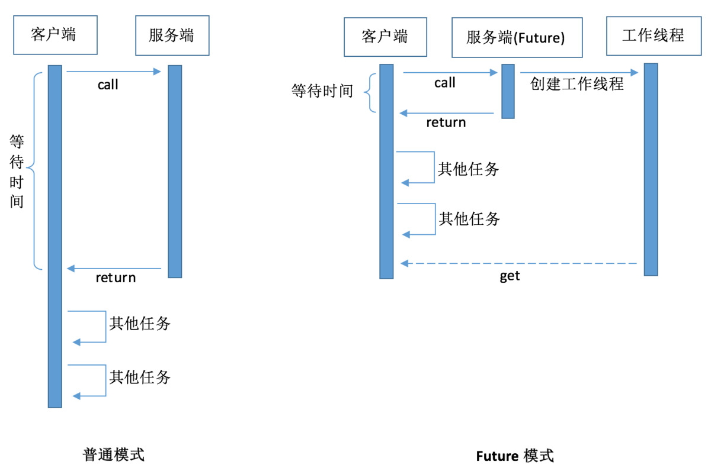

[TOC]


------


## 1. Spring Boot的定时任务Schedule

> ​		使用定时任务可以完成一些业务逻辑，比如定时同步、天气接口的数据获取，定时发送短信，邮件。以及商城中每天用户的限额，定时自动收货等等。定时器在项目中是常常会使用到的一个手段。
>
> ​		在Spring Boot中可以通过@Schedule注解来实现定时任务。

### 1.1 使用方法

- Spring Schedule包含在Spring-boot-starter中，不需要增加额外的依赖包
- 在Spring的配置类中添加@EnableScheduling 注解，开启定时任务
- 在方法上添加@Scheduled注解

### 1.2 @Scheduled 注解的参数

- fixedRate=5000				上次开始执行时间点之后5秒再次执行
- fixedDelay=5000				上次执行完之后5秒再次执行
- initialDelay=1000，fixedRate=5000				第一次延迟1秒后再执行fixedRate=5000任务
- cron=“0 30 11 ？ * *

```java
[秒] [分] [小时] [日] [月] [周] [年]
/**
 *解释：
 *第一位，表示秒，取值 0-59
 *第二位，表示分，取值 0-59
 *第三位，表示小时，取值0 0-23
 *第四位，日期，取值 1-31
 *第五位，月份，取值 1-12
 *第六位，星期几，取值 1-7
 *第七位，年份，可以留空，取值 1970-2099
 */
通配符说明:
1.* 表示所有值。 例如:在分的字段上设置 *,表示每一分钟都会触发。
2.? 表示不指定值。使用的场景为不需要关心当前设置这个字段的值。例如:要在每月的10号触发一个操作，但不关心是周几，所以需要周位置的那个字段设置为”?” 具体设置为 0 0 0 10 * ?
3.- 表示区间。例如 在小时上设置 “10-12”,表示 10,11,12点都会触发。
4., 表示指定多个值，例如在周字段上设置 “MON,WED,FRI” 表示周一，周三和周五触发
5./ 用于递增触发。如在秒上面设置”5/15” 表示从5秒开始，每增15秒触发(5,20,35,50)。 在日字段上设置’1/3’所示每月1号开始，每隔三天触发一次。
6.L 表示最后的意思。在日字段设置上，表示当月的最后一天(依据当前月份，如果是二月还会依据是否是润年[leap]), 在周字段上表示星期六，相当于”7”或”SAT”。如果在”L”前加上数字，则表示该数据的最后一个。例如在周字段上设置”6L”这样的格式,则表示“本月最后一个星期五”
7.W 表示离指定日期的最近那个工作日(周一至周五). 例如在日字段上置”15W”，表示离每月15号最近的那个工作日触发。如果15号正好是周六，则找最近的周五(14号)触发, 如果15号是周未，则找最近的下周一(16号)触发.如果15号正好在工作日(周一至周五)，则就在该天触发。如果指定格式为 “1W”,它则表示每月1号往后最近的工作日触发。如果1号正是周六，则将在3号下周一触发。(注，”W”前只能设置具体的数字,不允许区间”-“)。
8.# 序号(表示每月的第几个周几)，例如在周字段上设置”6#3”表示在每月的第三个周六.注意如果指定”#5”,正好第五周没有周六，则不会触发该配置(用在母亲节和父亲节再合适不过了) ；小提示：’L’和 ‘W’可以一组合使用。如果在日字段上设置”LW”,则表示在本月的最后一个工作日触发；周字段的设置，若使用英文字母是不区分大小写的，即MON与mon相同。

示例：
0 0 3 * * ?         每天 3 点执行
0 5 3 * * ?         每天 3 点 5 分执行
0 5 3 ? * *         每天 3 点 5 分执行
0 5/10 3 * * ?      每天 3 点 5 分，15 分，25 分，35 分，45 分，55 分这几个点执行
0 10 3 ? * 1        每周星期天的 3 点10 分执行，注：1 表示星期天
0 10 3 ? * 1#3      每个月的第三个星期的星期天 执行，#号只能出现在星期的位置
*/5 * * * * ?		每隔5秒执行一次
0 */1 * * * ?		每隔1分钟执行一次
0 0 1 1 * ?			每月1号凌晨1点执行一次
0 0 23 L * ?		每月最后一天23点执行一次
0 0 1 ? * L			每周星期六凌晨1点实行一次
0 26,29,33 * * * ?	在26分、29分、33分执行一次
0 0 0,13,18 * * ?	每天的0点、13点、18点都执行一次

注：第六位(星期几)中的数字可能表达不太正确，可以使用英文缩写来表示，如：Sun
```

### 1.3  实现并行定时任务

​	继承SchedulingConfigurer类并重写起方法

```java
@Configuration
@EnableScheduling
public class ScheduleConfig implements SchedulingConfigurer {
    @Override
    public void configureTasks(ScheduledTaskRegistrar taskRegistrar) {
        taskRegistrar.setScheduler(taskExecutor());
    }
    @Bean(destroyMethod="shutdown")
    public Executor taskExecutor() {
        return Executors.newScheduledThreadPool(100);
    }
}
```

### 1.4 @Scheduled实现多任务并发

​	给类添加注解@EnableAsync，并给方法添加注解@Async，方法的该调用将异步发生。

```java
@Component
@Configurable
@EnableScheduling
@EnableAsync
public class DemoTask {
     @Async
     @Scheduled(cron = "0/5 * *  * * ? ")
     public void startSchedule() {
         System.out.println("===========1=>");
     }
    @Async
     @Scheduled(cron = "0/5 * *  * * ? ")
     public void startSchedule2() {
         System.out.println("===========2=>");       
     }
}
```

### 1.5 实际应用中的问题

> ​		通过spring加载或初始化的Bean，在服务停止的时候，spring会自动卸载（销毁）。但是由于线程是JVM级别的，如果用户在Web应用中启动了一个线程，那么这个线程的生命周期并不会和Web应用保持一致。也就是说，即使Web应用停止了，这个线程依然没有结束（死亡）。

- 解决方法

  - 如果对象是通过Spring容器初始化的，在销毁时会调用Destory方法，可以通过实现DisposableBean接口主动关闭线程

  ```java
  @Component
  public class MyTask implements DisposableBean{
      @Override
      public void destroy() throws Exception {
          //关闭线程或线程池
          ThreadPoolTaskScheduler scheduler = (ThreadPoolTaskScheduler)applicationContext.getBean("scheduler");
          scheduler.shutdown();
      }
      //省略...
  }
  ```

  - 如果不是通过Spring容器初始化的，可以通过Servlet上下文监听器，在Servlet服务器停止时主动关闭线程

  ```java
  public class MyTaskListenter implements ServletContextListener{
      @Override
      public void contextDestroyed(ServletContextEvent arg0) {
          //关闭线程或线程池
      }
      //省略...
  }
  ```

### 1.6 分布式部署问题

​	在实际项目中，我们的系统通常会做集群、分布式或灾备部署。那么定时任务就可能出现并发问题，即同一个任务在多个服务器上同时在运行。

- 解决方法（分布式锁）：

  - 通过数据库表锁

  - 通过缓存中间件

  - 通过Zookeeper实现

## 2. Spring Boot中MongoDB的使用

[参考地址](http://www.mydlq.club/article/85/)

### 2.1 使用方法

#### 1) 导入maven依赖

```xml
<!-- Lombok -->
<!-- Lombok 工具依赖，便于生成实体对象的 Get 与 Set 方法。 -->
<dependency>
    <groupId>org.projectlombok</groupId>
    <artifactId>lombok</artifactId>
    <scope>provided</scope>
</dependency>
<!-- SpringBoot MongoDB -->
<dependency>
    <groupId>org.springframework.boot</groupId>
    <artifactId>spring-boot-starter-data-mongodb</artifactId>
</dependency>
```

#### 2) 在application.yml文件中配置MongoDB

```yaml
spring:
  data:
    mongodb:
      host: 127.0.0.1
      port: 27017
      database: test
      username: admin
      password: 123456
```

#### 3）创建用于测试的实体类

**User.java**

```java
import com.fasterxml.jackson.annotation.JsonFormat;
import lombok.Data;
import lombok.ToString;
import lombok.experimental.Accessors;
import org.springframework.data.mongodb.core.mapping.MongoId;
import java.util.Date;
@Data
@ToString
@Accessors(chain = true)
public class User {
    /**
     * 使用 @MongoID 能更清晰的指定 _id 主键
     */
    @MongoId
    private String id;
    private String name;
    private String sex;
    private Integer salary;
    private Integer age;
    @JsonFormat( pattern ="yyyy-MM-dd", timezone ="GMT+8")
    private Date birthday;
    private String remake;
    private Status status;

}
```

> 使用 Lombok 中的 @Accessors(chain = true) 注解，能让我们方便使用链式方法创建实体对象。

**Status.java**

```java
import lombok.Data;
import lombok.ToString;
import lombok.experimental.Accessors;

@Data
@ToString
@Accessors(chain = true)
public class Status {

    private Integer weight;
    private Integer height;

}
```

#### 4) SpringBoot 启动类

创建 SpringBoot 启动类，方便测试：

```java
import org.springframework.boot.SpringApplication;
import org.springframework.boot.autoconfigure.SpringBootApplication;
import springfox.documentation.swagger2.annotations.EnableSwagger2;
@EnableSwagger2
@SpringBootApplication
public class Application {
    public static void main(String[] args) {
        SpringApplication.run(Application.class, args);
    }
}
```

### 2.2  具体操作

#### 1） MongoDB 集合操作

##### 创建集合

示例代码如下：

```java
import org.springframework.data.mongodb.core.CollectionOptions;
import org.springframework.data.mongodb.core.MongoTemplate;
import org.springframework.data.mongodb.core.query.Criteria;
import org.springframework.data.mongodb.core.query.CriteriaDefinition;
import org.springframework.data.mongodb.core.validation.Validator;
import org.springframework.stereotype.Service;
import javax.annotation.Resource;
@Service
public class CreateCollectionService {
    @Resource
    private MongoTemplate mongoTemplate;
    /**
     * 创建【集合
     * 创建一个大小没有限制的集合（默认集合创建方式） 
     * @return 创建集合的结果
     */
    public Object createCollection() {
        // 设置集合名称
        String collectionName = "users1";
        // 创建集合并返回集合信息
        mongoTemplate.createCollection(collectionName);
        // 检测新的集合是否存在，返回创建结果
        return mongoTemplate.collectionExists(collectionName) ? "创建视图成功" : "创建视图失败";
    }
    /**
     * 创建【固定大小集合】
     * 创建集合并设置 `capped=true` 创建 `固定大小集合`，可以配置参数 `size` 限制文档大小，可以配置参数 `max` 限制集合文档数量。
     * @return 创建集合的结果
     */
    public Object createCollectionFixedSize() {
        // 设置集合名称
        String collectionName = "users2";
        // 设置集合参数
        long size = 1024L;
        long max = 5L;
        // 创建固定大小集合
        CollectionOptions collectionOptions = CollectionOptions.empty()
                // 创建固定集合。固定集合是指有着固定大小的集合，当达到最大值时，它会自动覆盖最早的文档。
                .capped()
                // 固定集合指定一个最大值，以千字节计(KB),如果 capped 为 true，也需要指定该字段。
                .size(size)
                // 指定固定集合中包含文档的最大数量。
                .maxDocuments(max);
        // 执行创建集合
        mongoTemplate.createCollection(collectionName, collectionOptions);
        // 检测新的集合是否存在，返回创建结果
        return mongoTemplate.collectionExists(collectionName) ? "创建视图成功" : "创建视图失败";
    }
    /**
     * 创建【验证文档数据】的集合
     *
     * 创建集合并在文档"插入"与"更新"时进行数据效验，如果符合创建集合设置的条件就进允许更新与插入，否则则按照设置的设置的策略进行处理。
     * * 效验级别：
     *   - off：关闭数据校验。
     *   - strict：(默认值) 对所有的文档"插入"与"更新"操作有效。
     *   - moderate：仅对"插入"和满足校验规则的"文档"做"更新"操作有效。对已存在的不符合校验规则的"文档"无效。 
     * * 执行策略：
     *   - error：(默认值) 文档必须满足校验规则，才能被写入。
     *   - warn：对于"文档"不符合校验规则的 MongoDB 允许写入，但会记录一条告警到 mongod.log 中去。日志内容记录报错信息以及该"文档"的完整记录。
     * 
     * @return 创建集合结果
     */
    public Object createCollectionValidation() {
        // 设置集合名称
        String collectionName = "users3";
        // 设置验证条件,只允许岁数大于20的用户信息插入
        CriteriaDefinition criteria = Criteria.where("age").gt(20);
        // 设置集合选项验证对象
        CollectionOptions collectionOptions = CollectionOptions.empty()
                .validator(Validator.criteria(criteria))
                // 设置效验级别
                .strictValidation()
                // 设置效验不通过后执行的动作
                .failOnValidationError();
        // 执行创建集合
        mongoTemplate.createCollection(collectionName, collectionOptions);
        // 检测新的集合是否存在，返回创建结果
        return mongoTemplate.collectionExists(collectionName) ? "创建集合成功" : "创建集合失败";
    }

}
```

##### 查询集合

```java
import org.springframework.data.mongodb.core.MongoTemplate;
import org.springframework.stereotype.Service;
import javax.annotation.Resource;

@Service
public class QueryCollectionService {

    @Resource
    private MongoTemplate mongoTemplate;

    /**
     * 获取【集合名称】列表
     *
     * @return 集合名称列表
     */
    public Object getCollectionNames() {
        // 执行获取集合名称列表
        return mongoTemplate.getCollectionNames();
    }

    /**
     * 检测集合【是否存在】
     *
     * @return 集合是否存在
     */
    public boolean collectionExists() {
        // 设置集合名称
        String collectionName = "users";
        // 检测新的集合是否存在，返回检测结果
        return mongoTemplate.collectionExists(collectionName);
    }

}
```

##### 删除集合

```java
import org.springframework.data.mongodb.core.MongoTemplate;
import org.springframework.stereotype.Service;
import javax.annotation.Resource;

@Service
public class RemoveCollectionService {

    @Resource
    private MongoTemplate mongoTemplate;

    /**
     * 删除【集合】
     *
     * @return 创建集合结果
     */
    public Object dropCollection() {
        // 设置集合名称
        String collectionName = "users3";
        // 执行删除集合
        mongoTemplate.getCollection(collectionName).drop();
        // 检测新的集合是否存在，返回删除结果
        return !mongoTemplate.collectionExists(collectionName) ? "删除集合成功" : "删除集合失败";
    }

}
```

#### 2） MongoDB 视图操作

```java
import org.bson.Document;
import org.bson.conversions.Bson;
import org.springframework.data.mongodb.core.MongoTemplate;
import org.springframework.stereotype.Service;
import javax.annotation.Resource;
import java.util.ArrayList;
import java.util.List;

@Service
public class ViewService {

    @Resource
    private MongoTemplate mongoTemplate;

    /**
     * 创建视图
     *
     * @return 创建视图结果
     */
    public Object createView() {
        // 设置视图名
        String newViewName = "usersView";
        // 设置获取数据的集合名称
        String collectionName = "users";
        // 定义视图的管道,可是设置视图显示的内容多个筛选条件
        List<Bson> pipeline = new ArrayList<>();
        // 设置条件，用于筛选集合中的文档数据，只有符合条件的才会映射到视图中
        pipeline.add(Document.parse("{\"$match\":{\"sex\":\"女\"}}"));
        // 执行创建视图
        mongoTemplate.getDb().createView(newViewName, collectionName, pipeline);
        // 检测新的集合是否存在，返回创建结果
        return mongoTemplate.collectionExists(newViewName) ? "创建视图成功" : "创建视图失败";
    }

    /**
     * 删除视图
     *
     * @return 删除视图结果
     */
    public Object dropView() {
        // 设置待删除的视图名称
        String viewName = "usersView";
        // 检测视图是否存在
        if (mongoTemplate.collectionExists(viewName)) {
            // 删除视图
            mongoTemplate.getDb().getCollection(viewName).drop();
            return "删除视图成功";
        }
        // 检测新的集合是否存在，返回创建结果
        return !mongoTemplate.collectionExists(viewName) ? "删除视图成功" : "删除视图失败";
    }

}
```

#### 3) MongoDB 文档操作

##### 文档插入

```java
import lombok.extern.slf4j.Slf4j;
import mydlq.club.example.entity.Status;
import mydlq.club.example.entity.User;
import org.springframework.data.mongodb.core.MongoTemplate;
import org.springframework.stereotype.Service;
import javax.annotation.Resource;
import java.util.ArrayList;
import java.util.Collection;
import java.util.Date;
import java.util.List;

@Slf4j
@Service
public class InsertService {

    /** 设置集合名称 */
    private static final String COLLECTION_NAME = "users";

    @Resource
    private MongoTemplate mongoTemplate;

    /**
     * 插入【一条】文档数据，如果文档信息已经【存在就抛出异常】
     *
     * @return 插入的文档信息
     */
    public Object insert() {
        // 设置用户信息
        User user = new User()
                .setId("10")
                .setAge(22)
                .setSex("男")
                .setRemake("无")
                .setSalary(1500)
                .setName("zhangsan")
                .setBirthday(new Date())
                .setStatus(new Status().setHeight(180).setWeight(150));
        // 插入一条用户数据，如果文档信息已经存在就抛出异常
        User newUser = mongoTemplate.insert(user, COLLECTION_NAME);
        // 输出存储结果
        log.info("存储的用户信息为：{}", newUser);
        return newUser;
    }

    /**
     * 插入【多条】文档数据，如果文档信息已经【存在就抛出异常】
     *
     * @return 插入的多个文档信息
     *
     */
    public Object insertMany(){
        // 设置两个用户信息
        User user1 = new User()
                .setId("11")
                .setAge(22)
                .setSex("男")
                .setRemake("无")
                .setSalary(1500)
                .setName("shiyi")
                .setBirthday(new Date())
                .setStatus(new Status().setHeight(180).setWeight(150));
        User user2 = new User()
                .setId("12")
                .setAge(22)
                .setSex("男")
                .setRemake("无")
                .setSalary(1500)
                .setName("shier")
                .setBirthday(new Date())
                .setStatus(new Status().setHeight(180).setWeight(150));
        // 使用户信息加入结合
        List<User> userList = new ArrayList<>();
        userList.add(user1);
        userList.add(user2);
        // 插入一条用户数据，如果某个文档信息已经存在就抛出异常
        Collection<User> newUserList = mongoTemplate.insert(userList, COLLECTION_NAME);
        // 输出存储结果
        for (User user : newUserList) {
            log.info("存储的用户信息为：{}", user);
        }
        return newUserList;
    }

}
```

##### 文档存储

```java
import lombok.extern.slf4j.Slf4j;
import mydlq.club.example.entity.Status;
import mydlq.club.example.entity.User;
import org.springframework.data.mongodb.core.MongoTemplate;
import org.springframework.stereotype.Service;
import javax.annotation.Resource;
import java.util.Date;

@Slf4j
@Service
public class SaveService {

    /** 设置集合名称 */
    private static final String COLLECTION_NAME = "users";

    @Resource
    private MongoTemplate mongoTemplate;

    /**
     * 存储【一条】用户信息，如果文档信息已经【存在就执行更新】
     *
     * @return 存储的文档信息
     */
    public Object save() {
        // 设置用户信息
        User user = new User()
                .setId("13")
                .setAge(22)
                .setSex("男")
                .setRemake("无")
                .setSalary(2800)
                .setName("kuiba")
                .setBirthday(new Date())
                .setStatus(new Status().setHeight(169).setWeight(150));
        // 存储用户信息,如果文档信息已经存在就执行更新
        User newUser = mongoTemplate.save(user, COLLECTION_NAME);
        // 输出存储结果
        log.info("存储的用户信息为：{}", newUser);
        return newUser;
    }

}
```

##### 文档查询

| 操作符         | 格式                                                | 实例                                                         | 与 RDBMS where 语句比较                            |
| -------------- | --------------------------------------------------- | ------------------------------------------------------------ | -------------------------------------------------- |
| 等于（=）      | {<key> : {<value>}}                                 | db.test.find( {price : 24} )                                 | where price = 24                                   |
| 大于（>）      | {<key> : {$gt : <value>}}                           | db.test.find( {price : {$gt : 24}} )                         | where price > 24                                   |
| 小于（<）      | {<key> : {$lt : <value>}}                           | db.test.find( {price : {$lt : 24}} )                         | where price < 24                                   |
| 大于等于（>=） | {<key> : {$gte : <value>}}                          | db.test.find( {price : {$gte : 24}} )                        | where price >= 24                                  |
| 小于等于（<=） | {<key> : {$lte : <value>}}                          | db.test.find( {price : {$lte : 24}} )                        | where price <= 24                                  |
| 不等于（!=）   | {<key> : {$ne : <value>}}                           | db.test.find( {price : {$ne : 24}} )                         | where price != 24                                  |
| 与（and）      | {key01 : value01, key02 : value02, ...}             | db.test.find( {name : "《MongoDB 入门教程》", price : 24} )  | where name = "《MongoDB 入门教程》" and price = 24 |
| 或（or）       | {$or : [{key01 : value01}, {key02 : value02}, ...]} | db.test.find( {$or:[{name : "《MongoDB 入门教程》"},{price : 24}]} ) | where name = "《MongoDB 入门教程》" or price = 24  |

```java
import lombok.extern.slf4j.Slf4j;
import mydlq.club.example.entity.User;
import org.springframework.data.domain.Sort;
import org.springframework.data.mongodb.core.MongoTemplate;
import org.springframework.data.mongodb.core.query.Criteria;
import org.springframework.data.mongodb.core.query.Query;
import org.springframework.stereotype.Service;
import javax.annotation.Resource;
import java.util.Arrays;
import java.util.List;

@Slf4j
@Service
public class QueryService {

    /**
     * 设置集合名称
     */
    private static final String COLLECTION_NAME = "users";

    @Resource
    private MongoTemplate mongoTemplate;

    /**
     * 查询集合中的【全部】文档数据
     *
     * @return 全部文档列表
     */
    public Object findAll() {
        // 执行查询集合中全部文档信息
        List<User> documentList = mongoTemplate.findAll(User.class, COLLECTION_NAME);
        // 输出结果
        for (User user : documentList) {
            log.info("用户信息：{}", user);
        }
        return documentList;
    }

    /**
     * 根据【文档ID】查询集合中文档数据
     *
     * @return 文档信息
     */
    public Object findById() {
        // 设置查询的文档 ID
        String id = "1";
        // 根据文档ID查询集合中文档数据，并转换为对应 Java 对象
        User user = mongoTemplate.findById(id, User.class, COLLECTION_NAME);
        // 输出结果
        log.info("用户信息：{}", user);
        return user;
    }

    /**
     * 根据【条件】查询集合中【符合条件】的文档，只取【第一条】数据
     *
     * @return 符合条件的第一条文档
     */
    public Object findOne() {
        // 设置查询条件参数
        int age = 22;
        // 创建条件对象
        Criteria criteria = Criteria.where("age").is(age);
        // 创建查询对象，然后将条件对象添加到其中
        Query query = new Query(criteria);
        // 查询一条文档，如果查询结果中有多条文档，那么就取第一条
        User user = mongoTemplate.findOne(query, User.class, COLLECTION_NAME);
        // 输出结果
        log.info("用户信息：{}", user);
        return user;
    }

    /**
     * 根据【条件】查询集合中【符合条件】的文档，获取其【文档列表】
     *
     * @return 符合条件的文档列表
     */
    public Object findByCondition() {
        // 设置查询条件参数
        String sex = "女";
        // 创建条件对象
        Criteria criteria = Criteria.where("sex").is(sex);
        // 创建查询对象，然后将条件对象添加到其中
        Query query = new Query(criteria);
        // 查询并返回结果
        List<User> documentList = mongoTemplate.find(query, User.class, COLLECTION_NAME);
        // 输出结果
        for (User user : documentList) {
            log.info("用户信息：{}", user);
        }
        return documentList;
    }

    /**
     * 根据【条件】查询集合中【符合条件】的文档，获取其【文档列表】并【排序】
     *
     * @return 符合条件的文档列表
     */
    public Object findByConditionAndSort() {
        // 设置查询条件参数
        String sex = "男";
        String sort = "age";
        // 创建条件对象
        Criteria criteria = Criteria.where("sex").is(sex);
        // 创建查询对象，然后将条件对象添加到其中，然后根据指定字段进行排序
        Query query = new Query(criteria).with(Sort.by(sort));
        // 执行查询
        List<User> documentList = mongoTemplate.find(query, User.class, COLLECTION_NAME);
        // 输出结果
        for (User user : documentList) {
            log.info("用户信息：{}", user);
        }
        return documentList;
    }

    /**
     * 根据【单个条件】查询集合中的文档数据，并【按指定字段进行排序】与【限制指定数目】
     *
     * @return 符合条件的文档列表
     */
    public Object findByConditionAndSortLimit() {
        // 设置查询条件参数
        String sex = "男";
        String sort = "age";
        int limit = 2;
        // 创建条件对象
        Criteria criteria = Criteria.where("sex").is(sex);
        // 创建查询对象，然后将条件对象添加到其中
        Query query = new Query(criteria).with(Sort.by(sort)).limit(limit);
        // 执行查询
        List<User> documentList = mongoTemplate.find(query, User.class, COLLECTION_NAME);
        // 输出结果
        for (User user : documentList) {
            log.info("用户信息：{}", user);
        }
        return documentList;
    }

    /**
     * 根据【单个条件】查询集合中的文档数据，并【按指定字段进行排序】与【并跳过指定数目】
     *
     * @return 符合条件的文档列表
     */
    public Object findByConditionAndSortSkip() {
        // 设置查询条件参数
        String sex = "男";
        String sort = "age";
        int skip = 1;
        // 创建条件对象
        Criteria criteria = Criteria.where("sex").is(sex);
        // 创建查询对象，然后将条件对象添加到其中
        Query query = new Query(criteria).with(Sort.by(sort)).skip(skip);
        // 查询并返回结果
        List<User> documentList = mongoTemplate.find(query, User.class, COLLECTION_NAME);
        // 输出结果
        for (User user : documentList) {
            log.info("用户信息：{}", user);
        }
        return documentList;
    }

    /**
     * 查询【存在指定字段名称】的文档数据
     *
     * @return 符合条件的文档列表
     */
    public Object findByExistsField() {
        // 设置查询条件参数
        String field = "sex";
        // 创建条件
        Criteria criteria = Criteria.where(field).exists(true);
        // 创建查询对象，然后将条件对象添加到其中
        Query query = new Query(criteria);
        // 查询并返回结果
        List<User> documentList = mongoTemplate.find(query, User.class, COLLECTION_NAME);
        // 输出结果
        for (User user : documentList) {
            log.info("用户信息：{}", user);
        }
        return documentList;
    }

    /**
     * 根据【AND】关联多个查询条件，查询集合中的文档数据
     *
     * @return 符合条件的文档列表
     */
    public Object findByAndCondition() {
        // 设置查询条件参数
        String sex = "男";
        Integer age = 22;
        // 创建条件
        Criteria criteriaSex = Criteria.where("sex").is(sex);
        Criteria criteriaAge = Criteria.where("age").is(age);
        // 创建条件对象，将上面条件进行 AND 关联
        Criteria criteria = new Criteria().andOperator(criteriaSex, criteriaAge);
        // 创建查询对象，然后将条件对象添加到其中
        Query query = new Query(criteria);
        // 查询并返回结果
        List<User> documentList = mongoTemplate.find(query, User.class, COLLECTION_NAME);
        // 输出结果
        for (User user : documentList) {
            log.info("用户信息：{}", user);
        }
        return documentList;
    }

    /**
     * 根据【OR】关联多个查询条件，查询集合中的文档数据
     *
     * @return 符合条件的文档列表
     */
    public Object findByOrCondition() {
        // 设置查询条件参数
        String sex = "男";
        int age = 22;
        // 创建条件
        Criteria criteriaSex = Criteria.where("sex").is(sex);
        Criteria criteriaAge = Criteria.where("age").is(age);
        // 创建条件对象，将上面条件进行 OR 关联
        Criteria criteria = new Criteria().orOperator(criteriaSex, criteriaAge);
        // 创建查询对象，然后将条件对象添加到其中
        Query query = new Query(criteria);
        // 查询并返回结果
        List<User> documentList = mongoTemplate.find(query, User.class, COLLECTION_NAME);
        // 输出结果
        for (User user : documentList) {
            log.info("用户信息：{}", user);
        }
        return documentList;
    }

    /**
     * 根据【IN】关联多个查询条件，查询集合中的文档数据
     *
     * @return 符合条件的文档列表
     */
    public Object findByInCondition() {
        // 设置查询条件参数
        Integer[] ages = {20, 22, 25};
        // 创建条件
        List<Integer> ageList = Arrays.asList(ages);
        // 创建条件对象
        Criteria criteria = Criteria.where("age").in(ageList);
        // 创建查询对象，然后将条件对象添加到其中
        Query query = new Query(criteria);
        // 查询并返回结果
        List<User> documentList = mongoTemplate.find(query, User.class, COLLECTION_NAME);
        // 输出结果
        for (User user : documentList) {
            log.info("用户信息：{}", user);
        }
        return documentList;
         }

    /**
     * 根据【逻辑运算符】查询集合中的文档数据
     *
     * @return 符合条件的文档列表
     */
    public Object findByOperator() {
        // 设置查询条件参数
        int min = 25;
        int max = 35;
        // 创建条件对象
        Criteria criteria = Criteria.where("age").gt(min).lte(max);
        // 创建查询对象，然后将条件对象添加到其中
        Query query = new Query(criteria);
        // 查询并返回结果
        List<User> documentList = mongoTemplate.find(query, User.class, COLLECTION_NAME);
        // 输出结果
        for (User user : documentList) {
            log.info("用户信息：{}", user);
        }
        return documentList;
    }

    /**
     * 根据【正则表达式】查询集合中的文档数据
     *
     * @return 符合条件的文档列表
     */
    public Object findByRegex() {
        // 设置查询条件参数
        String regex = "^zh*";
        // 创建条件对象
        Criteria criteria = Criteria.where("name").regex(regex);
        // 创建查询对象，然后将条件对象添加到其中
        Query query = new Query(criteria);
        // 查询并返回结果
        List<User> documentList = mongoTemplate.find(query, User.class, COLLECTION_NAME);
        // 输出结果
        for (User user : documentList) {
            log.info("用户信息：{}", user);
        }
        return documentList;
    }

    /**
     * 统计集合中符合【查询条件】的文档【数量】
     *
     * @return 符合条件的文档列表
     */
    public Object countNumber() {
        // 设置查询条件参数
        int age = 22;
        // 创建条件对象
        Criteria criteria = Criteria.where("age").is(age);
        // 创建查询对象，然后将条件对象添加到其中
        Query query = new Query(criteria);
        // 查询并返回结果
        long count = mongoTemplate.count(query, User.class, COLLECTION_NAME);
        // 输出结果
        log.info("符合条件的文档数量：{}", count);
        return count;
    }

}
        
```

##### 文档更新

```java
import com.mongodb.client.result.UpdateResult;
import lombok.extern.slf4j.Slf4j;
import mydlq.club.example.entity.User;
import org.springframework.data.domain.Sort;
import org.springframework.data.mongodb.core.MongoTemplate;
import org.springframework.data.mongodb.core.query.Criteria;
import org.springframework.data.mongodb.core.query.Query;
import org.springframework.data.mongodb.core.query.Update;
import org.springframework.stereotype.Service;
import javax.annotation.Resource;

@Slf4j
@Service
public class UpdateService {

    /**
     * 设置集合名称
     */
    private static final String COLLECTION_NAME = "users";

    @Resource
    private MongoTemplate mongoTemplate;

    /**
     * 更新集合中【匹配】查询到的第一条文档数据，如果没有找到就【创建并插入一个新文档】
     *
     * @return 执行更新的结果
     */
    public Object update() {
        // 创建条件对象
        Criteria criteria = Criteria.where("age").is(30);
        // 创建查询对象，然后将条件对象添加到其中
        Query query = new Query(criteria);
        // 创建更新对象,并设置更新的内容
        Update update = new Update().set("age", 33).set("name", "zhangsansan");
        // 执行更新，如果没有找到匹配查询的文档，则创建并插入一个新文档
        UpdateResult result = mongoTemplate.upsert(query, update, User.class, COLLECTION_NAME);
        // 输出结果信息
        String resultInfo = "匹配到" + result.getMatchedCount() + "条数据,对第一条数据进行了更改";
        log.info("更新结果：{}", resultInfo);
        return resultInfo;
    }

    /**
     * 更新集合中【匹配】查询到的【文档数据集合】中的【第一条数据】
     *
     * @return 执行更新的结果
     */
    public Object updateFirst() {
        // 创建条件对象
        Criteria criteria = Criteria.where("name").is("zhangsan");
        // 创建查询对象，然后将条件对象添加到其中，并设置排序
        Query query = new Query(criteria).with(Sort.by("age").ascending());
        // 创建更新对象,并设置更新的内容
        Update update = new Update().set("age", 30).set("name", "zhangsansan");
        // 执行更新
        UpdateResult result = mongoTemplate.updateFirst(query, update, User.class, COLLECTION_NAME);
        // 输出结果信息
        String resultInfo = "共匹配到" + result.getMatchedCount() + "条数据,修改了" + result.getModifiedCount() + "条数据";
        log.info("更新结果：{}", resultInfo);
        return resultInfo;
    }

    /**
     * 更新【匹配查询】到的【文档数据集合】中的【所有数据】
     *
     * @return 执行更新的结果
     */
    public Object updateMany() {
        // 创建条件对象
        Criteria criteria = Criteria.where("age").gt(28);
        // 创建查询对象，然后将条件对象添加到其中
        Query query = new Query(criteria);
        // 设置更新字段和更新的内容
        Update update = new Update().set("age", 29).set("salary", "1999");
        // 执行更新
        UpdateResult result = mongoTemplate.updateMulti(query, update, User.class, COLLECTION_NAME);
        // 输出结果信息
        String resultInfo = "总共匹配到" + result.getMatchedCount() + "条数据,修改了" + result.getModifiedCount() + "条数据";
        log.info("更新结果：{}", resultInfo);
        return resultInfo;
    }

}
```

##### 文档删除

```java
import com.mongodb.client.result.DeleteResult;
import lombok.extern.slf4j.Slf4j;
import mydlq.club.example.entity.User;
import org.springframework.data.mongodb.core.MongoTemplate;
import org.springframework.data.mongodb.core.query.Criteria;
import org.springframework.data.mongodb.core.query.Query;
import org.springframework.stereotype.Service;
import javax.annotation.Resource;
import java.util.List;

@Slf4j
@Service
public class RemoveService {

    /**
     * 设置集合名称
     */
    private static final String COLLECTION_NAME = "users";

    @Resource
    private MongoTemplate mongoTemplate;

    /**
     * 删除集合中【符合条件】的【一个]或[多个】文档
     *
     * @return 删除用户信息的结果
     */
    public Object remove() {
        // 设置查询条件参数
        int age = 30;
        String sex = "男";
        // 创建条件对象
        Criteria criteria = Criteria.where("age").is(age).and("sex").is(sex);
        // 创建查询对象，然后将条件对象添加到其中
        Query query = new Query(criteria);
        // 执行删除查找到的匹配的全部文档信息
        DeleteResult result = mongoTemplate.remove(query, COLLECTION_NAME);
        // 输出结果信息
        String resultInfo = "成功删除 " + result.getDeletedCount() + " 条文档信息";
        log.info(resultInfo);
        return resultInfo;
    }

    /**
     * 删除【符合条件】的【单个文档】，并返回删除的文档。
     *
     * @return 删除的用户信息
     */
    public Object findAndRemove() {
        // 设置查询条件参数
        String name = "zhangsansan";
        // 创建条件对象
        Criteria criteria = Criteria.where("name").is(name);
        // 创建查询对象，然后将条件对象添加到其中
        Query query = new Query(criteria);
        // 执行删除查找到的匹配的第一条文档,并返回删除的文档信息
        User result = mongoTemplate.findAndRemove(query, User.class, COLLECTION_NAME);
        // 输出结果信息
        String resultInfo = "成功删除文档信息，文档内容为：" + result;
        log.info(resultInfo);
        return result;
    }

    /**
     * 删除【符合条件】的【全部文档】，并返回删除的文档。
     *
     * @return 删除的全部用户信息
     */
    public Object findAllAndRemove() {
        // 设置查询条件参数
        int age = 22;
        // 创建条件对象
        Criteria criteria = Criteria.where("age").is(age);
        // 创建查询对象，然后将条件对象添加到其中
        Query query = new Query(criteria);
        // 执行删除查找到的匹配的全部文档,并返回删除的全部文档信息
        List<User> resultList = mongoTemplate.findAllAndRemove(query, User.class, COLLECTION_NAME);
        // 输出结果信息
        String resultInfo = "成功删除文档信息，文档内容为：" + resultList;
        log.info(resultInfo);
        return resultList;
    }

}
```

#### 4) MongoDB 聚合操作

##### 聚合表达式

```java
import lombok.extern.slf4j.Slf4j;
import org.springframework.data.domain.Sort;
import org.springframework.data.mongodb.core.MongoTemplate;
import org.springframework.data.mongodb.core.aggregation.Aggregation;
import org.springframework.data.mongodb.core.aggregation.AggregationOperation;
import org.springframework.data.mongodb.core.aggregation.AggregationResults;
import org.springframework.stereotype.Service;
import javax.annotation.Resource;
import java.util.Map;

/**
 * 聚合表达式 $group
 *
 * @author mydlq
 */
@Slf4j
@Service
public class AggregateGroupService {

    /**
     * 设置集合名称
     */
    private static final String COLLECTION_NAME = "users";

    @Resource
    private MongoTemplate mongoTemplate;

    /**
     * 使用管道操作符 $group 结合 $count 方法进行聚合统计
     *
     * @return 聚合结果
     */
    public Object aggregationGroupCount() {
        // 使用管道操作符 $group 进行分组，然后统计各个组的文档数量
        AggregationOperation group = Aggregation.group("age").count().as("numCount");
        // 将操作加入到聚合对象中
        Aggregation aggregation = Aggregation.newAggregation(group);
        // 执行聚合查询
        AggregationResults<Map> results = mongoTemplate.aggregate(aggregation, COLLECTION_NAME, Map.class);
        for (Map result : results.getMappedResults()) {
            log.info("{}", result);
        }
        return results.getMappedResults();
    }

    /**
     * 使用管道操作符 $group 结合表达式操作符 $max 进行聚合统计
     *
     * @return 聚合结果
     */
    public Object aggregationGroupMax() {
        // 使用管道操作符 $group 进行分组，然后统计各个组文档某字段最大值
        AggregationOperation group = Aggregation.group("sex").max("salary").as("salaryMax");
        // 将操作加入到聚合对象中
        Aggregation aggregation = Aggregation.newAggregation(group);
        // 执行聚合查询
        AggregationResults<Map> results = mongoTemplate.aggregate(aggregation, COLLECTION_NAME, Map.class);
        for (Map result : results.getMappedResults()) {
            log.info("{}", result);
        }
        return results.getMappedResults();
    }

    /**
     * 使用管道操作符 $group 结合表达式操作符 $min 进行聚合统计
     *
     * @return 聚合结果
     */
    public Object aggregationGroupMin() {
        // 使用管道操作符 $group 进行分组，然后统计各个组文档某字段最小值
        AggregationOperation group = Aggregation.group("sex").min("salary").as("salaryMin");
        // 将操作加入到聚合对象中
        Aggregation aggregation = Aggregation.newAggregation(group);
        // 执行聚合查询
        AggregationResults<Map> results = mongoTemplate.aggregate(aggregation, COLLECTION_NAME, Map.class);
        for (Map result : results.getMappedResults()) {
            log.info("{}", result);
        }
        return results.getMappedResults();
    }

    /**
     * 使用管道操作符 $group 结合表达式操作符 $sum 进行聚合统计
     *
     * @return 聚合结果
     */
    public Object aggregationGroupSum() {
        // 使用管道操作符 $group 进行分组，然后统计各个组文档某字段值合计
        AggregationOperation group = Aggregation.group("sex").sum("salary").as("salarySum");
        // 将操作加入到聚合对象中
        Aggregation aggregation = Aggregation.newAggregation(group);
        // 执行聚合查询
        AggregationResults<Map> results = mongoTemplate.aggregate(aggregation, COLLECTION_NAME, Map.class);
        for (Map result : results.getMappedResults()) {
            log.info("{}", result);
        }
        return results.getMappedResults();
    }

    /**
     * 使用管道操作符 $group 结合表达式操作符 $avg 进行聚合统计
     *
     * @return 聚合结果
     */
    public Object aggregationGroupAvg() {
        // 使用管道操作符 $group 进行分组，然后统计各个组文档某字段值平均值
        AggregationOperation group = Aggregation.group("sex").avg("salary").as("salaryAvg");
        // 将操作加入到聚合对象中
        Aggregation aggregation = Aggregation.newAggregation(group);
        // 执行聚合查询
        AggregationResults<Map> results = mongoTemplate.aggregate(aggregation, COLLECTION_NAME, Map.class);
        for (Map result : results.getMappedResults()) {
            log.info("{}", result);
        }
        return results.getMappedResults();
    }

    /**
     * 使用管道操作符 $group 结合表达式操作符 $first 获取每个组的包含某字段的文档的第一条数据
     *
     * @return 聚合结果
     */
    public Object aggregationGroupFirst() {
        // 先对数据进行排序，然后使用管道操作符 $group 进行分组，最后统计各个组文档某字段值第一个值
        AggregationOperation sort = Aggregation.sort(Sort.by("salary").ascending());
        AggregationOperation group = Aggregation.group("sex").first("salary").as("salaryFirst");
        // 将操作加入到聚合对象中
        Aggregation aggregation = Aggregation.newAggregation(sort, group);
        // 执行聚合查询
        AggregationResults<Map> results = mongoTemplate.aggregate(aggregation, COLLECTION_NAME, Map.class);
        for (Map result : results.getMappedResults()) {
            log.info("{}", result);
        }
        return results.getMappedResults();
    }

    /**
     * 使用管道操作符 $group 结合表达式操作符 $last 获取每个组的包含某字段的文档的最后一条数据
     *
     * @return 聚合结果
     */
    public Object aggregationGroupLast() {
        // 先对数据进行排序，然后使用管道操作符 $group 进行分组，最后统计各个组文档某字段值第最后一个值
        AggregationOperation sort = Aggregation.sort(Sort.by("salary").ascending());
        AggregationOperation group = Aggregation.group("sex").last("salary").as("salaryLast");
        // 将操作加入到聚合对象中
        Aggregation aggregation = Aggregation.newAggregation(sort, group);
        // 执行聚合查询
        AggregationResults<Map> results = mongoTemplate.aggregate(aggregation, COLLECTION_NAME, Map.class);
        for (Map result : results.getMappedResults()) {
            log.info("{}", result);
        }
        return results.getMappedResults();
    }

    /**
     * 使用管道操作符 $group 结合表达式操作符 $push 获取某字段列表
     *
     * @return 聚合结果
     */
    public Object aggregationGroupPush() {
        // 先对数据进行排序，然后使用管道操作符 $group 进行分组，然后以数组形式列出某字段的全部值
        AggregationOperation push = Aggregation.group("sex").push("salary").as("salaryFirst");
        // 将操作加入到聚合对象中
        Aggregation aggregation = Aggregation.newAggregation(push);
        // 执行聚合查询
        AggregationResults<Map> results = mongoTemplate.aggregate(aggregation, COLLECTION_NAME, Map.class);
        for (Map result : results.getMappedResults()) {
            log.info("{}", result);
        }
        return results.getMappedResults();
    }

}
```

##### 聚合管道操作符

```java
import lombok.extern.slf4j.Slf4j;
import org.springframework.data.domain.Sort;
import org.springframework.data.mongodb.core.MongoTemplate;
import org.springframework.data.mongodb.core.aggregation.Aggregation;
import org.springframework.data.mongodb.core.aggregation.AggregationOperation;
import org.springframework.data.mongodb.core.aggregation.AggregationResults;
import org.springframework.data.mongodb.core.query.Criteria;
import org.springframework.stereotype.Service;
import javax.annotation.Resource;
import java.util.Map;

@Slf4j
@Service
public class AggregatePipelineService {

    /**
     * 设置集合名称
     */
    private static final String COLLECTION_NAME = "users";

    @Resource
    private MongoTemplate mongoTemplate;

    /**
     * 使用 $group 和 $match 聚合,先使用 $match 过滤文档，然后再使用 $group 进行分组
     *
     * @return 聚合结果
     */
    public Object aggregateGroupMatch() {
        // 设置聚合条件，先使用 $match 过滤岁数大于 25 的用户，然后按性别分组，统计每组用户工资最高值
        AggregationOperation match = Aggregation.match(Criteria.where("age").lt(25));
        AggregationOperation group = Aggregation.group("sex").max("salary").as("sexSalary");
        // 将操作加入到聚合对象中
        Aggregation aggregation = Aggregation.newAggregation(match, group);
        // 执行聚合查询
        AggregationResults<Map> results = mongoTemplate.aggregate(aggregation, COLLECTION_NAME, Map.class);
        for (Map result : results.getMappedResults()) {
            log.info("{}", result);
        }
        return results.getMappedResults();
    }

    /**
     * 使用 $group 和 $sort 聚合,先使用 $group 进行分组，然后再使用 $sort 排序
     *
     * @return 聚合结果
     */
    public Object aggregateGroupSort() {
        // 设置聚合条件，按岁数分组，然后统计每组用户工资最大值和用户数，按每组用户工资最大值升序排序
        AggregationOperation group = Aggregation.group("age")
                .max("salary").as("ageSalary")
                .count().as("ageCount");
        AggregationOperation sort = Aggregation.sort(Sort.by("ageSalary").ascending());
        // 将操作加入到聚合对象中
        Aggregation aggregation = Aggregation.newAggregation(group, sort);
        // 执行聚合查询
        AggregationResults<Map> results = mongoTemplate.aggregate(aggregation, COLLECTION_NAME, Map.class);
        for (Map result : results.getMappedResults()) {
            log.info("{}", result);
        }
        return results.getMappedResults();
    }

    /**
     * 使用 $group 和 $limit 聚合,先使用 $group 进行分组，然后再使用 $limit 限制一定数目文档
     *
     * @return 聚合结果
     */
    public Object aggregateGroupLimit() {
        // 设置聚合条件，先按岁数分组，然后求每组用户的工资总数、最大值、最小值、平均值，限制只能显示五条
        AggregationOperation group = Aggregation.group("age")
                .sum("salary").as("sumSalary")
                .max("salary").as("maxSalary")
                .min("salary").as("minSalary")
                .avg("salary").as("avgSalary");
        AggregationOperation limit = Aggregation.limit(5L);
        // 将操作加入到聚合对象中
        Aggregation aggregation = Aggregation.newAggregation(group, limit);
        // 执行聚合查询
        AggregationResults<Map> results = mongoTemplate.aggregate(aggregation, COLLECTION_NAME, Map.class);
        for (Map result : results.getMappedResults()) {
            log.info("{}", result);
        }
        return results.getMappedResults();
    }

    /**
     * 使用 $group 和 $skip 聚合,先使用 $group 进行分组，然后再使用 $skip 跳过一定数目文档
     *
     * @return 聚合结果
     */
    public Object aggregateGroupSkip() {
        // 设置聚合条件，先按岁数分组，然后求每组用户的工资总数、最大值、最小值、平均值，跳过前 2 条
        AggregationOperation group = Aggregation.group("age")
                .sum("salary").as("sumSalary")
                .max("salary").as("maxSalary")
                .min("salary").as("minSalary")
                .avg("salary").as("avgSalary");
        AggregationOperation limit = Aggregation.skip(2L);
        // 将操作加入到聚合对象中
        Aggregation aggregation = Aggregation.newAggregation(group, limit);
        // 执行聚合查询
        AggregationResults<Map> results = mongoTemplate.aggregate(aggregation, COLLECTION_NAME, Map.class);
        for (Map result : results.getMappedResults()) {
            log.info("{}", result);
        }
        return results.getMappedResults();
    }

    /**
     * 使用 $group 和 $project 聚合,先使用 $group 进行分组，然后再使用 $project 限制显示的字段
     *
     * @return 聚合结果
     */
    public Object aggregateGroupProject() {
        // 设置聚合条件,按岁数分组，然后求每组用户工资最大值、最小值，然后使用 $project 限制值显示 salaryMax 字段
        AggregationOperation group = Aggregation.group("age")
                .max("salary").as("maxSalary")
                .min("salary").as("minSalary");
        AggregationOperation project = Aggregation.project("maxSalary");
        // 将操作加入到聚合对象中
        Aggregation aggregation = Aggregation.newAggregation(group, project);
        // 执行聚合查询
        AggregationResults<Map> results = mongoTemplate.aggregate(aggregation, COLLECTION_NAME, Map.class);
        for (Map result : results.getMappedResults()) {
            log.info("{}", result);
        }
        return results.getMappedResults();
    }

    /**
     * 使用 $group 和 $unwind 聚合,先使用 $project 进行分组，然后再使用 $unwind 拆分文档中的数组为一条新文档记录
     *
     * @return 聚合结果
     */
    public Object aggregateProjectUnwind() {
        // 设置聚合条件，设置显示`name`、`age`、`title`字段，然后将结果中的多条文档按 title 字段进行拆分
        AggregationOperation project = Aggregation.project("name", "age", "title");
        AggregationOperation unwind = Aggregation.unwind("title");
        // 将操作加入到聚合对象中
        Aggregation aggregation = Aggregation.newAggregation(project, unwind);
        // 执行聚合查询
        AggregationResults<Map> results = mongoTemplate.aggregate(aggregation, COLLECTION_NAME, Map.class);
        for (Map result : results.getMappedResults()) {
            log.info("{}", result);
        }
        return results.getMappedResults();
    }

}
```

**聚合管道操作符:**

- **$project：** 可以从文档中选择想要的字段，和不想要的字段（指定的字段可以是来自输入文档或新计算字段的现有字段 ，也可以通过管道表达式进行一些复杂的操作，例如数学操作，日期操作，字符串操作，逻辑操作。
- **$match：** 用于过滤数据，只输出符合条件的文档。$match使用MongoDB的标准查询操作。
- **$limit：** 用来限制MongoDB聚合管道返回的文档数。
- **$skip：** 在聚合管道中跳过指定数量的文档，并返回余下的文档。
- **$unwind：** 将文档中的某一个数组类型字段拆分成多条，每条包含数组中的一个值。
- **$group：** 将集合中的文档分组，可用于统计结果。
- **$sort：** 将输入文档排序后输出。

#### 5) MongoDB 索引操作

##### 创建索引

```java
import com.mongodb.client.model.Filters;
import com.mongodb.client.model.IndexOptions;
import com.mongodb.client.model.Indexes;
import lombok.extern.slf4j.Slf4j;
import org.springframework.data.mongodb.core.MongoTemplate;
import org.springframework.stereotype.Service;
import javax.annotation.Resource;

@Slf4j
@Service
public class CreateIndexService {

    /** 设置集合名称 */
    private static final String COLLECTION_NAME = "users";

    @Resource
    private MongoTemplate mongoTemplate;

    /**
     * 创建升序索引
     *
     * @return 索引信息
     */
    public Object createAscendingIndex() {
        // 设置字段名称
        String field = "name";
        // 创建索引
        return mongoTemplate.getCollection(COLLECTION_NAME).createIndex(Indexes.ascending(field));
    }

    /**
     * 创建降序索引
     *
     * @return 索引信息
     */
    public Object createDescendingIndex() {
        // 设置字段名称
        String field = "name";
        // 创建索引
        return mongoTemplate.getCollection(COLLECTION_NAME).createIndex(Indexes.descending(field));
    }

    /**
     * 创建升序复合索引
     *
     * @return 索引信息
     */
    public Object createCompositeIndex() {
        // 设置字段名称
        String field1 = "name";
        String field2 = "age";
        // 创建索引
        return mongoTemplate.getCollection(COLLECTION_NAME).createIndex(Indexes.ascending(field1, field2));
    }

    /**
     * 创建文字索引
     *
     * @return 索引信息
     */
    public Object createTextIndex() {
        // 设置字段名称
        String field = "name";
        // 创建索引
        return mongoTemplate.getCollection(COLLECTION_NAME).createIndex(Indexes.text(field));
    }

    /**
     * 创建哈希索引
     *
     * @return 索引信息
     */
    public Object createHashIndex() {
        // 设置字段名称
        String field = "name";
        // 创建索引
        return mongoTemplate.getCollection(COLLECTION_NAME).createIndex(Indexes.hashed(field));
    }

    /**
     * 创建升序唯一索引
     *
     * @return 索引信息
     */
    public Object createUniqueIndex() {
        // 设置字段名称
        String indexName = "name";
        // 配置索引选项
        IndexOptions options = new IndexOptions();
        // 设置为唯一索引
        options.unique(true);
        // 创建索引
        return mongoTemplate.getCollection(COLLECTION_NAME).createIndex(Indexes.ascending(indexName), options);
    }

    /**
     * 创建局部索引
     *
     * @return 索引信息
     */
    public Object createPartialIndex() {
        // 设置字段名称
        String field = "name";
        // 配置索引选项
        IndexOptions options = new IndexOptions();
        // 设置过滤条件
        options.partialFilterExpression(Filters.exists("name", true));
        // 创建索引
        return mongoTemplate.getCollection(COLLECTION_NAME).createIndex(Indexes.ascending(field), options);
    }

}
```

##### 查询索引

```java
import com.mongodb.client.ListIndexesIterable;
import lombok.extern.slf4j.Slf4j;
import org.bson.Document;
import org.springframework.data.mongodb.core.MongoTemplate;
import org.springframework.stereotype.Service;
import javax.annotation.Resource;
import java.util.ArrayList;
import java.util.List;

/**
 * 查询索引操作
 *
 * @author mydlq
 */
@Slf4j
@Service
public class QueryIndexService {

    /** 设置集合名称 */
    private static final String COLLECTION_NAME = "users";

    @Resource
    private MongoTemplate mongoTemplate;

    /**
     * 获取当前【集合】对应的【所有索引】的【名称列表】
     *
     * @return 当前【集合】所有【索引名称列表】
     */
    public Object getIndexAll() {
        // 获取集合中所有列表
        ListIndexesIterable<Document> indexList = mongoTemplate.getCollection(COLLECTION_NAME).listIndexes();
        // 创建字符串集合
        List<Document> list = new ArrayList<>();
        // 获取集合中全部索引信息
        for (Document document : indexList) {
            log.info("索引列表：{}",document);
            list.add(document);
        }
        return list;
    }

}
```

##### 删除索引

```java
import lombok.extern.slf4j.Slf4j;
import org.springframework.data.mongodb.core.MongoTemplate;
import org.springframework.stereotype.Service;
import javax.annotation.Resource;

@Slf4j
@Service
public class RemoveIndexService {

    @Resource
    private MongoTemplate mongoTemplate;

    /** 设置集合名称 */
    private static final String COLLECTION_NAME = "users";

    /**
     * 根据索引名称移除索引
     */
    public void removeIndex() {
        // 设置索引名称
        String indexName = "name_1";
        // 删除集合中某个索引
        mongoTemplate.getCollection(COLLECTION_NAME).dropIndex(indexName);
    }

    /**
     * 移除全部索引
     */
    public void removeIndexAll() {
        // 删除集合中全部索引
        mongoTemplate.getCollection(COLLECTION_NAME).dropIndexes();
    }

}
```

#### 6) MongoDB RunCommand 命令操作

##### RunCommand 命令

```java
import org.bson.Document;
import org.bson.conversions.Bson;
import org.springframework.data.mongodb.core.MongoTemplate;
import org.springframework.stereotype.Service;
import javax.annotation.Resource;

@Service
public class RunCommandService {

    @Resource
    private MongoTemplate mongoTemplate;

    /**
     * 执行 mongoDB 自定义命令，详情可以查看：https://docs.mongodb.com/manual/reference/command/
     *
     * @return 执行命令返回结果的 Json 结果
     * @description 执行自定义 mongoDB 命令
     */
    public Object runCommand() {
        // 自定义命令
        String jsonCommand = "{\"buildInfo\":1}";
        // 将 JSON 字符串解析成 MongoDB 命令
        Bson bson = Document.parse(jsonCommand);
        // 执行自定义命令
        return mongoTemplate.getDb().runCommand(bson);
    }

}
```

### 2.3 SpringBoot 引入 MongoDB 中的事务

> 注意：单节点 mongodb 不支持事务，需要搭建 MongoDB 复制集。

#### 1)配置事务管理器

```java
import org.springframework.context.annotation.Bean;
import org.springframework.context.annotation.Configuration;
import org.springframework.data.mongodb.MongoDatabaseFactory;
import org.springframework.data.mongodb.MongoTransactionManager;

/**
 * 配置事务管理器
 *
 * @author mydlq
 */
@Configuration
public class TransactionConfig {

    @Bean
    MongoTransactionManager transactionManager(MongoDatabaseFactory dbFactory) {
        return new MongoTransactionManager(dbFactory);
    }

}
```

#### 2) 创建事务测试服务

```java
import mydlq.club.example.entity.Status;
import mydlq.club.example.entity.User;
import org.springframework.data.mongodb.core.MongoTemplate;
import org.springframework.stereotype.Service;
import org.springframework.transaction.annotation.Transactional;
import javax.annotation.Resource;
import java.util.Date;

@Service
public class TransactionExample {

    /** 设置集合名称 */
    private static final String COLLECTION_NAME = "users";

    @Resource
    private MongoTemplate mongoTemplate;

    @Transactional
    public Object transactionTest(){
        // 设置两个用户信息
        User user1 = new User()
                .setId("11")
                .setAge(22)
                .setSex("男")
                .setRemake("无")
                .setSalary(1500)
                .setName("shiyi")
                .setBirthday(new Date())
                .setStatus(new Status().setHeight(180).setWeight(150));
        // 插入数据
        User newUser1 = mongoTemplate.insert(user1, COLLECTION_NAME);
        // 抛出异常，观察数据是否进行回滚
        int error = 1/0;
        return newUser1;
    }

}
```

## 3. MyBatis-generator的使用

### 3.1 MyBatis-generator介绍

​		使用mybatis时需要手写model实体类，mapper接口，mapper的xml配置文件，但是这些工作工作量太大，mybatis-generator可以自动你想生成这些代码，而且生成的mapper接口几乎可以满足单个数据表的所有增删改查功能。

### 3.2 MyBatis-generator的使用

#### ① 引入maven依赖

需要引入的包：

​		1.mybatis-spring-boot-starter

​		2.mybatis-generator-core插件

​		3.mysql-connercor-java

​		4.plugin

```xml
<dependencies>
     <dependency>
         <groupId>org.mybatis.spring.boot</groupId>
         <artifactId>mybatis-spring-boot-starter</artifactId>
         <version>1.3.0</version>
    </dependency>
    <dependency>
        <groupId>org.mybatis.generator</groupId>
        <artifactId>mybatis-generator-core</artifactId>
        <version>1.3.2</version>
    </dependency>
     <dependency>
         <groupId>mysql</groupId>
         <artifactId>mysql-connector-java</artifactId>
         <version>5.1.34</version>
    </dependency>
</dependencies>

<build>
	<finalName>finalName</finalName>
    <resources>
    	<resource>
        	<directory>src/main/java</directory>
            <includes>
                <include>**/*.xml</include>
            </includes>
        </resource>
        <resource>
        	<directory>src/main/resources</directory>
            <includes>
            	<include>**/*.properties</include>
                <include>**/*.xml</include>
            </includes>
            <filtering>true</filtering>
        </resource>
    </resources>
    
    <plugins>
         <!--<plugin>
                Mybatis-generator插件,用于自动生成Mapper和POJO
                <groupId>org.mybatis.generator</groupId>
                <artifactId>mybatis-generator-maven-plugin</artifactId>
                <version>1.3.2</version>
                <configuration>
                    配置文件的位置
                    <configurationFile>src/main/resources/mybatis/mybatis-generator.xml</configurationFile>
                    <verbose>true</verbose>
                    <overwrite>true</overwrite>
                </configuration>
                <executions>
                    <execution>
                        <id>Generate MyBatis Artifacts</id>
                        <goals>
                            <goal>generate</goal>
                        </goals>
                    </execution>
                </executions>
                <dependencies>
                    <dependency>
                        <groupId>org.mybatis.generator</groupId>
                        <artifactId>mybatis-generator-core</artifactId>
                        <version>1.3.2</version>
                    </dependency>
                </dependencies>
            </plugin>-->
    	<plugin>
            <groupId>org.mybatis.generator</groupId>
            <artifactId>mybatis-generator-maven-plugin</artifactId>
            <version>1.3.2</version>
        	<dependencies>
            	<dependency>
                	<groupId>cn.com.xxx</groupId>
                    <artifactId>xxx</artifactId>
                    <version>xxxxx</version>
                </dependency>
            </dependencies>
            <configuration>
            	<verbose>true</verbose>
                <overwrite>true</overwrite>
            </configuration>
        </plugin>
    </plugins>
</build>
```

#### ② 创建数据库

​	此处省略数据库创建语句

#### ③ 写mybatis-generator.xml配置文件

```xml
<?xml version="1.0" encoding="UTF-8"?>
<!DOCTYPE generatorConfiguration
        PUBLIC "-//mybatis.org//DTD MyBatis Generator Configuration 1.0//EN"
        "http://mybatis.org/dtd/mybatis-generator-config_1_0.dtd">
<generatorConfiguration>
    <!--数据库驱动包-->
    <classPathEntry    location="在maven中找到mysql-connector-java-xxx.jar的路径"/>
    <context id="Myontext"    targetRuntime="MyBatis3" defaultModelType="flat">
        <commentGenerator>
            <property name="suppressDate" value="true"/>
            <property name="suppressAllComments" value="true"/>
        </commentGenerator>
        <!--数据库连接-->
        <jdbcConnection driverClass="com.mysql.cj.jdbc.Driver"				       		connectionURL="jdbc:mysql://localhost:3306/miaosha" 
                        userId="root" 
                        password="123">
        </jdbcConnection>
        <javaTypeResolver>
            <property name="forceBigDecimals" value="false"/>
        </javaTypeResolver>
        <!--生成Model类存放位置-->
        <javaModelGenerator targetPackage="cn.com.model" targetProject="src/main/java">
            <property name="enableSubPackages" value="true"/>
            <property name="trimStrings" value="true"/>
        </javaModelGenerator>
        <!--生成映射文件存放位置-->
        <sqlMapGenerator targetPackage="com.dao" targetProject="src/main/resources">
            <property name="enableSubPackages" value="true"/>
        </sqlMapGenerator>
        <!--生成Dao类存放位置-->
        <javaClientGenerator type="XMLMAPPER" targetPackage="com.dao" targetProject="src/main/java">
            <property name="enableSubPackages" value="true"/>
        </javaClientGenerator>
        <!--生成对应表及类名-->
        <table tableName="user_info" domainObjectName="userDAO" enableCountByExample="false" enableUpdateByExample="false" enableDeleteByExample="false" enableSelectByExample="false" selectByExampleQueryId="false">
        </table>
    </context>
</generatorConfiguration>
```

#### ④ maven build

`mybatis-generator:generete`

## 4. SpringBoot中数据库的主从复制读写分离以及多数据源的配置（Druid）

#### 4.1通过注解的方式来决定使用哪一个数据源

##### 4.1.1 application.yml配置文件配置数据源信息

```yml
#数据源信息
datasource: 
	mysql: 
        jdbc-url: jdbc:mysql://10.12.49.55:3306/smartcity-01
        username: root
        password: root
        # 使用druid数据源
        type: com.alibaba.druid.pool.DruidDataSource
        driverClassName: com.mysql.jdbc.Driver
    other:
        jdbc-url: jdbc:sqlserver://10.12.49.35:1433;DatabaseName=LandscapingDB
        username: sa
        password: Sql123
        #使用druid数据源
        type: com.alibaba.druid.pool.DruidDataSource
        driverClassName: com.microsoft.sqlserver.jdbc.SQLServerDriver
#druid的通用配置
spring:
	druid: 
      initialSize: 5 # 初始化连接池个数
      minIdle: 2 # 最小连接池个数——>已经不再使用，配置了也没效果      
      maxActive: 20 # 最大连接池个数 
      maxWait: 60000  # 配置获取连接等待超时的时间，单位毫秒，缺省启用公平锁，并发效率会有所下降
      timeBetweenEvictionRunsMillis: 60000  # 配置间隔多久才进行一次检测，检测需要关闭的空闲连接，单位是毫秒
      minEvictableIdleTimeMillis: 300000   # 配置一个连接在池中最小生存的时间，单位是毫秒
      # 用来检测连接是否有效的sql，要求是一个查询语句。
      # 如果validationQuery为null，testOnBorrow、testOnReturn、testWhileIdle都不会起作用
      validationQuery: SELECT 1 FROM DUAL
      # 建议配置为true，不影响性能，并且保证安全性。
      # 申请连接的时候检测，如果空闲时间大于timeBetweenEvictionRunsMillis，执行validationQuery检测连接是否有效。
      testWhileIdle: true
      # 申请连接时执行validationQuery检测连接是否有效，做了这个配置会降低性能
      testOnBorrow: false
      # 归还连接时执行validationQuery检测连接是否有效，做了这个配置会降低性能
      testOnReturn: false
      # 打开PSCache，并且指定每个连接上PSCache的大小
      poolPreparedStatements: true
      maxPoolPreparedStatementPerConnectionSize: 20
      # 通过别名的方式配置扩展插件，多个英文逗号分隔，常用的插件有： 
      # 监控统计用的filter:stat
      # 日志用的filter:log4j
      # 防御sql注入的filter:wall
      filters: stat,wall,log4j
      # 通过connectProperties属性来打开mergeSql功能；慢SQL记录
      connectionProperties: druid.stat.mergeSql=true;druid.stat.slowSqlMillis=5000
      # 合并多个DruidDataSource的监控数据
      useGlobalDataSourceStat: true
      #druid数据源监控
      web-stat-filter:
        enabled: true
        url-pattern: "/*"
        exclusions: "*.js,*.gif,*.jpg,*.png,*.css,*.ico,/druid/*"
        session-stat-max-count: 1000
        session-stat-enable: true
        profile-enable: true
      stat-view-servlet:
        enabled: true
        url-pattern: "/druid/*"
        login-username: root
        login-password: root
        allow: 127.0.0.1
        reset-enable: true		
```

##### 4.1.2 DataBaseConfiuration注册数据源

```java

@Configuration
@EnableTransactionManagement
public class DataBaseConfiguration implements EnvironmentAware{
    private Environment env;
    public DataBaseConfiguration(){
        System.out.println("DataBaseConfiguration");
    }
    @Override
    public void setEnirvonment(Environment env){
        this.env = env;
    }
    //mysql数据源
    public DataSource mysql()throws SQLException{
        DruidDataSource datasource = new DruidDataSource();
        datasource.setUrl(env.getProperty("datasource.mysql.jdbc-url"));
        datasource.setDriverClassName(env.getProperty("datasource.mysql.driverClassName"));
        datasource.setUsername(env.getProperty("datasource.mysql.username"));
        datasource.setPassword(env.getProperty("datasource.mysql.password"));
        this.config(datasource);
        return datasource;
    }
    
    //mssql数据源
    public DataSource mssql()throws SQLException{
        DruidDataSource datasource = new DruidDataSource();
        datasource.setUrl(env.getProperty("datasource.mssql.jdbc-url"));
        datasource.setDriverClassName(env.getProperty("datasource.mssql.driverClassName"));
        datasource.setUsername(env.getProperty("datasource.mssql.username"));
        datasource.setPassword(env.getProperty("datasource.mssql.password"));
        this.config(datasource);
        return datasource;
    }
    
    //druid的通用配置
    public void config(DruidDataSource d)throws SQLException{
        d.setInitialSize(Integer.parseInt(env.getProperty("spring.datasource.druid.initialSize")));
        ......        
    }
     
    @Bean
    public DynamicDataSource dynamicDataSource()throws SQLException{
        DataSource mysql = mysql();
        DataSource mssql = mssql();
        Map<Object,Object> targetDataSource = new HashMap<Object,Object>();
        targetDataSource.put(DynamicDataSource.DataBase.Mysql,mysql);
        targetDataSource.put(DynamicDataSource.DataBase.Mssql,mssql);
        
        DynamicDataSource dataSource = new DynamicDataSource();
        dataSource.setTargetDataSources(targetDataSource);
        dataSource.setDefaultTargeDataSource(mysql);
        return dataSource;
    }
}
```

##### 4.1.3 DynamicDataSource

```java
public class DynamicDataSource extends AbstractRoutingDataSource{
    
    private static final ThreadLocal<DatabaseType> contextHolder = new ThreadLocal<DatabaseType>();
    
    @Override
    protected Object determineCurrentLookupKey(){
        return contextHolder.get();
    }
    
    public enum DatabaseType{
        Mysql,Mssql
    }
    public static void mysql(){
        contextHolder.set(DatabaseType.Mysql);
    }
    public static void mssql(){
        contextHolder.set(DatabaseType.Mssql);
    }

    public static void setDatabaseType(DatabaseType type){
        contextHolder.set(type);
    }

    public static DatabaseType getType(){
        return contextHolder.get();
    }

    public static void cleanAll(){
        contextHolder.remove();
    }

}
```

##### 4.1.4 DBBusinessConfig

```java
@Configuration
@MapperScan(basePackages="cn.com.wind.domain.mapper" ,sqlSessionTemplateRef="businessSqlSessionTemplate")
public class DBBusinessConfig{

    //连接池管道
    @Bean(name="businessSqlSessionFactory")
    public SqlSessionFactory managerSqlSessionFactory(DynamicDataSource datasource)throws Exception{
        SqlSessionFactoryBean sqlSessionFactoryBean = new SqlSessionFactoryBean();
        sqlSessionFactoryBean.setDataSource(datasource);
        PageHelper pageHelper = new PageHelper();
        Properties props = new Properties();
        //pros.setProperty("dialect","mysql");
        props.setProperty("resonable","false");
        props.setProperty("supportMethodsArguments","true");
        props.setProperty("params","count=countSql");
        //默认为false，当为true时自动检验适合的数据库
        props.setProperty("auto-dialect","true");
        //这条配置一定要加，不然mysql和SqlServer分页只能用一个，另一个会报错
        props.setProperty("auto-runtime-dialect","true");
        props.setProperty("returnPageInfo","check");
        pageHelper.setProperties(props);
        PathMatchingResourcePatternResolver resolver = new PathMatchingResourcePatternResolver();
        sqlSessionFactoryBean.setMapperLocations(resolver.getResources("classpath:*/mapper/*.xml"));

        return sqlSessionFactoryBean.getObject();

    }

    //数据源的事务
    @Bean(name="businessTransactionManager")
    public DataSourceTransationManager managerTransactionManager(DynamicDataSource datasource){
        return new DataSourceTransationManager(datasource);
    }

    @Bean(name="businessSqlSessionTemplate")
    public SqlSessionTemplate managerSqlSessionTemplate(@Qualifier("businessSqlSessionFactory") SqlSessionFactory sqlSessionFactory) throws Exception{
        return new SqlSessionTemplate(sqlSessionFactory);
    }
}
```

##### 4.1.5 自定义注解，区别不同的数据源

```java
public @interface Mysql{}
public @interface Mssql{}
```

##### 4.1.6 aop切面

```java
@Aspect
@Component
@Slf4j
public class DaraSourceAop{

    @Before("(@annotation(cn.com.wind.druid.Mysql)"+"&&!@annotation(cn.com.wind.druid.Mssql))")
    public void setDataSourceMysql(){
        DynamicDataSource.mysql();
        System.out.println("数据源切换到mysql");
    }

    @Before("(@annotation(cn.com.wind.druid.Mssql)"+"&&!@annotation(cn.com.wind.druid.Mysql))")
    public void setDataSourceMysql(){
        DynamicDataSource.mssql();
        System.out.println("数据源切换到mssql");
    }

    @After("(@annotation(cn.com.wind.druid.Mysql)"+"||@annotation(cn.com.wind.druid.Mssql))")
    public void setDataSourceMysql(){
        DynamicDataSource.cleanAll();
        System.out.println("释放数据源");
    }
}
```

​		配置完成后可以使用@Mysql或者@Mssql注解来控制使用哪一个数据源。

#### 4.2 使用mapper的位置来扫描包，确定使用哪一种数据源

## 5. Mysql的主从复制读写分离

### 5.1 Mysql中支持的复制类型

- **基于语句的复制**。在主服务器上执行的 SQL 语句，在从服务器上执行同样的语句。MySQL 默认采用基于语句的复制，效率比较高。

- **基于行的复制**。把改变的内容复制过去，而不是把命令在从服务器上执行一遍。

- **混合类型的复制**。默认采用基于语句的复制，一旦发现基于语句无法精确复制时，就会采用基于行的复制。

- **全局事务标识符 GTID**（Global Transaction Identifier,GTID）

  默认使用基于sql语句的复制

### 5.2 mysql复制的工作流程



1. 在每个事务更新数据完成之前，Master 将这些改变记录进二进制日志。写入二进制日志完成后，Master 通知存储引擎提交事务。
2. Slave 将 Master 的 Binary log 复制到其中继日志（Relay log）。首先，Slave 开始一个工作线程——I/O 线程，I/O 线程在 Master 上打开一个普通的连接，然后开始 Binlog dump process。Binlog dump process 从  Master 的二进制日志中读取事件，如果已经跟上 Master，它会睡眠并等待 Master 产生新的事件。I/O  线程将这些事件写入中继日志。
3. SQLslave thread（SQL 从线程）处理该过程的最后一步。SQL  线程从中继日志读取事件，并重放其中的事件而更新 Slave 数据，使其与 Master 中的数据保持一致。只要该线程与 I/O  线程保持一致，中继日志通常会位于 OS 的缓存中，所以中继日志的开销很小。 复制过程有一个很重要的限制，即复制在 Slave  上是串行化的，也就是说 Master 上的并行更新操作不能在 Slave 上并行操作。

### 5.3读写分离

​		Apache ShardingSphere 是一套开源的分布式数据库中间件解决方案组成的生态圈，它由 JDBC、Proxy两部分组成。
ShardingSphere-JDBC定位为轻量级 Java 框架，在 Java 的 JDBC 层提供的额外服务。 它使用客户端直连数据库，以 jar  包形式提供服务，无需额外部署和依赖，可理解为增强版的 JDBC 驱动，完全兼容 JDBC 和各种 ORM 框架。
读写分离就可以使用ShardingSphere-JDBC实现。





下面演示一下SpringBoot+Mybatis+Mybatis-plus+druid+ShardingSphere-JDBC代码实现。

#### 项目配置

版本说明：

```properties
SpringBoot：2.0.1.RELEASE
druid：1.1.22
mybatis-spring-boot-starter:1.3.2
mybatis-plus-boot-starter：3.0.7
sharding-jdbc-spring-boot-starter:4.1.1
```

添加sharding-jdbc的maven配置：

```xml
<dependency>
    <groupId>org.apache.shardingsphere</groupId>
    <artifactId>sharding-jdbc-spring-boot-starter</artifactId>
    <version>4.1.1</version>
</dependency>
```

然后在application.yml添加配置：

```yml
# 这是使用druid连接池的配置，其他的连接池配置可能有所不同
spring:
  shardingsphere:
    datasource:
      names: master,slave0,slave1
      master:
        type: com.alibaba.druid.pool.DruidDataSource
        driver-class-name: com.mysql.jdbc.Driver
        url: jdbc:mysql://192.168.0.108:3306/test_db?useUnicode=true&characterEncoding=utf8&tinyInt1isBit=false&useSSL=false&serverTimezone=GMT
        username: yehongzhi
        password: YHZ@1234
      slave0:
        type: com.alibaba.druid.pool.DruidDataSource
        driver-class-name: com.mysql.jdbc.Driver
        url: jdbc:mysql://192.168.0.109:3306/test_db?useUnicode=true&characterEncoding=utf8&tinyInt1isBit=false&useSSL=false&serverTimezone=GMT
        username: yehongzhi
        password: YHZ@1234
      slave1:
        type: com.alibaba.druid.pool.DruidDataSource
        driver-class-name: com.mysql.jdbc.Driver
        url: jdbc:mysql://192.168.0.110:3306/test_db?useUnicode=true&characterEncoding=utf8&tinyInt1isBit=false&useSSL=false&serverTimezone=GMT
        username: yehongzhi
        password: YHZ@1234
    props:
      sql.show: true
    masterslave:
      load-balance-algorithm-type: round_robin
    sharding:
      master-slave-rules:
        master:
          master-data-source-name: master
          slave-data-source-names: slave0,slave1
```

sharding.master-slave-rules是标明主库和从库，一定不要写错，否则写入数据到从库，就会导致无法同步。

load-balance-algorithm-type是路由策略，round_robin表示轮询策略。

启动项目，可以看到以下信息，代表配置成功：



## 6.NIO

> ​		与流式I/O不同，NIO时基于块的，它以块为基本单位处理数据，在NIO中，最为重要的两个组件时Buffer和Channel。缓冲是一块连续的内存块，，s是NIO读写数据的中转地，通道表示缓冲数据的源头或目的地，用于向缓冲中写入数据，是访问缓冲的接口。
>
> ​	在读一个Channel的时候，需要先将数据读到对应的Buffer中，然后对Buffer进行读取。

- NIO进行文件复制的例子

```java
import java.io.FileInputStream;
import java.io.FileOutputStream;
import java.nio.ByteBuffer;
import java.nio.channels.FileChannel;
public class TestNIO {
	public static void main(String[] args) throws Exception {
		nioCopyFile("C:\\Users\\jjli.Ajay\\Desktop\\BZ.rar", "C:\\Users\\jjli.Ajay\\Desktop\\BZ222.rar");
	}
	public static void nioCopyFile(String resourse,String to) throws Exception {
		FileInputStream fis = new FileInputStream(resourse);
		FileOutputStream fos = new FileOutputStream(to);
		FileChannel readChannel = fis.getChannel();//读文件通道
		FileChannel writeChannel = fos.getChannel();//写文件通道
		ByteBuffer buffer = ByteBuffer.allocate(1024);//缓冲
		while(true) {
			buffer.clear();//清除缓冲区
			int len = readChannel.read(buffer);//通过channel通道读文件到缓冲
			if(len==-1) {
				break;
			}
			buffer.flip();//重置缓冲区，position为0，limit（实际大小）为之前的position，用于写文件
			writeChannel.write(buffer);//将缓冲区数据通过channel写入目标文件
		}
		readChannel.close();
		writeChannel.close();
		fos.close();
		fis.close();
	}
}
```

### 6.1Buffer的相关操作

- Buffer的创建

  `ByteBuffer Buffer= ByteBuffer.allocate(1024)` ----从堆中分配指定大小的buffer

  

  `byte array[] = new byte[1024];`

  `ByteBuffer buffer = ByteBuffer.wrap(array);` ----从已有的数组中创建

- 重置和清空缓冲区

|                     | rewind()                     | clear()                         | flip()           |
| ------------------- | :--------------------------- | :------------------------------ | :--------------- |
| position当前位置    | 置零                         | 置零                            | 置零             |
| mark标记            | 清空                         | 清空                            | 清空             |
| limit缓冲区实际上限 | 未改动                       | 设置为capacity（总容量>=limit） | 设置为position   |
| 作用                | 为读取Buffer中有效数据做准备 | 为重新写入Buffer做准备          | 在读写切换时调用 |

- 标志缓冲区

  mark()用于记录当前的位置，reset()函数用于恢复到mark所在的位置

- 复制缓冲区

  `public ByteBuffer duplicate();`

  ​		复制后的缓冲区和原缓冲区共享相同的内存数据（向原缓冲区添加数据，在新的缓冲区也可以看见），但是两者又独立各自维护了自己的position，limit，mark。

- 缓冲区分片`slice`

  ```java
  byte arr[] = new byte[]{123,234,456,....};
  ByteBuffer b = ByteBuffer.wrap(arr);
  b.position(1);
  b.limit(3);
  ByteBuffer subBuffer = b.slice();//截取position到limit，生成子缓冲区
  ```

  ​	对于子缓冲区的处理，父缓冲区也能够看到改动。

- 只读缓冲区

  `buffer.asReadOnlyBuffer()` ----创建只读缓冲区

  ​		特点：相当于对缓冲区的复制，但是不同于缓冲区复制的是：对于只读缓冲区，原缓冲区的改动对其可见，但是，不能对只读缓冲区进行修改，保护了原缓冲区的数据。

- 文件映射到缓冲区

  `MappedByteBuffer mbb = fc.map(FileChannel.MapMode.READ_WRITE,0,1024);`

  ```java
  RandomAccessFile raf = new RandomAccessFile("filePath");
  FileChannel fc = raf.getChannel();
  
  MappedByteBuffer mbb = fc.map(FileChannel.MapModel.READ_WRITE,0,raf.length());
  while(mbb.hasRemaining()){//当前位置和极限之间是否存在元素
    System.out.println((char)mbb.get())  
  }
  mbb.put(0,(byte)98);
  raf.close();
  ```

## 7.Future

> Future模式去除了主函数中的等待时间，并使得原本的等待时间段可以用于处理其他的业务逻辑，从而充分利用了计算机的资源



JDK的内置实现

```java
public class Main {
	public static void main(String[] args) throws InterruptedException, ExecutionException {
		FutureTask<String> future = new FutureTask<String>(new RealData("test"));
		ExecutorService executor = Executors.newFixedThreadPool(1);
		executor.submit(future);
		System.out.println("请求完毕！");
		Thread.sleep(10000);
		System.out.println("响应数据："+future.get());
	}
}
class RealData implements Callable<String> {
	private String para;
	public RealData(String para) {
		this.para = para;
	}
	public String call() throws Exception {
		//真实的业务逻辑，执行时间慢
		StringBuffer sb = new StringBuffer();
		for(int i = 0 ; i<10 ; i++) {
			sb.append(para);
			System.out.println("call:"+i+"......");
			Thread.sleep(100);
		}
		return sb.toString();
	}
}
```

## 8.JVM命令

### 8.1 开启自旋锁

` -XX:+UseSpinning` 开启自旋锁

` -XX:PreBlockSpin=8` 自旋锁的等待次数

### 8.2 锁消除

`-server -XX:+DoEscapeAnalysis`

` -server -XX:+EliminateLocks`

### 8.3 锁偏向

` -XX:+UseBiasedLocking`

### 8.4 Other

- ` -Xss1M` 	设置虚拟机栈（线程栈）内存大小
- ` -Xmx16M -Xms4M` 设置堆内存的上限为16M,最小为4M
- ` -Xmn2M`   设置新生代的大小，一般为整个堆大小的1/4到1/3

- ` -XX:NewSize -XX:MaxNewSize` 同上
- ` -XX:PermSize -XX:MaxPermSize`  设置持久代大小
- ` -XX:SurviorRatio=8` 设置eden和s0的比值
- ` -XX:NewRadio` 设置老年代和新生代的比例
- ` -XX:TargetSurvivorRadio` 设置survivor的使用率，到达使用率会将对象送到老年代 

### 8.5 jvm垃圾回收


#### (1) 与串行回收器相关的参数

- `-XX:+UseSerialGC`:在新生代和老年代使用串行回收器。

- `-XX:+SurvivorRatio`:设置 eden 区大小和 survivor 区大小的比例。

- ` -XX:+PretenureSizeThreshold`:设置大对象直接进入老年代的阈值。当对象的大小超过这个值时，将直接在老年代分配。

- ` -XX:MaxTenuringThreshold`:设置对象进入老年代的年龄的最大值。每一次 Minor GC 后，对象年龄就加 1。任何大于这个年龄的对象，一定会进入老年代。

#### (2) 与并行 GC 相关的参数

- ` -XX:+UseParNewGC`: 在新生代使用并行收集器。

- ` -XX:+UseParallelOldGC`: 老年代使用并行回收收集器。

- ` -XX:ParallelGCThreads`：设置用于垃圾回收的线程数。通常情况下可以和 CPU 数量相等。但在 CPU 数量比较多的情况下，设置相对较小的数值也是合理的。

- ` -XX:MaxGCPauseMills`：设置最大垃圾收集停顿时间。它的值是一个大于 0 的整数。收集器在工作时，会调整 Java 堆大小或者其他一些参数，尽可能地把停顿时间控制在 MaxGCPauseMills 以内。

- ` -XX:GCTimeRatio`:设置吞吐量大小，它的值是一个 0-100 之间的整数。假设 GCTimeRatio 的值为 n，那么系统将花费不超过 1/(1+n) 的时间用于垃圾收集。

- ` -XX:+UseAdaptiveSizePolicy`:打开自适应 GC 策略。在这种模式下，新生代的大小，eden 和 survivor 的比例、晋升老年代的对象年龄等参数会被自动调整，以达到在**堆大小、吞吐量和停顿时间**之间的平衡点。

#### (3) 与 CMS 回收器相关的参数

- ` -XX:+UseConcMarkSweepGC`: 新生代使用并行收集器，老年代使用 CMS+串行收集器。

- ` -XX:+ParallelCMSThreads`: 设定 CMS 的线程数量。

- ` -XX:+CMSInitiatingOccupancyFraction`:设置 CMS 收集器在老年代空间被使用多少后触发，默认为 68%。

- ` -XX:+UseFullGCsBeforeCompaction`:设定进行多少次 CMS 垃圾回收后，进行一次内存压缩。

- ` -XX:+CMSClassUnloadingEnabled`:允许对类元数据进行回收。

- ` -XX:+CMSParallelRemarkEndable`:启用并行重标记。

- ` -XX:CMSInitatingPermOccupancyFraction`:当永久区占用率达到这一百分比后，启动 CMS 回收 (前提是` -XX:+CMSClassUnloadingEnabled` 激活了)。

- ` -XX:UseCMSInitatingOccupancyOnly`:表示只在到达阈值的时候，才进行 CMS 回收。

- ` -XX:+CMSIncrementalMode`:使用增量模式，比较适合单 CPU。

#### (4) 与 G1 回收器相关的参数

- ` -XX:+UseG1GC`：使用 G1 回收器。

- ` -XX:+UnlockExperimentalVMOptions`:允许使用实验性参数。

- ` -XX:+MaxGCPauseMills`:设置最大垃圾收集停顿时间。

- ` -XX:+GCPauseIntervalMills`:设置停顿间隔时间。

#### (5) 其他参数

- ` -XX:+DisableExplicitGC`: 禁用显示 GC。

- ` -Xloggc:gc.log` 输出gc日志

### 8.6实用JVM参数

- JIT编译参数

  ` -XX:CompileThreshold=10000`  :当一个方法被调用10000次时，将字节码编译成本地代码提高函数的执行效率。client模式下默认为1500，server模式下默认为10000

- 堆快照

  ` -XX:+HeapDumpOnOutOfMemoryError -XX:HeapDumpPath=C:\m.hprof`  程序发生OOM退出系统时，将当前堆信息保存到文件中，通过Visual VM查看导致OOM的具体原因
  
- 错误处理

  ` -XX:OutOfMemoryError=C:\reset.bat` :arrow_right_hook:当发生错误时运行第三方脚本，如重置系统


1064612809@qq.com

FXc05080821!

W932449158


