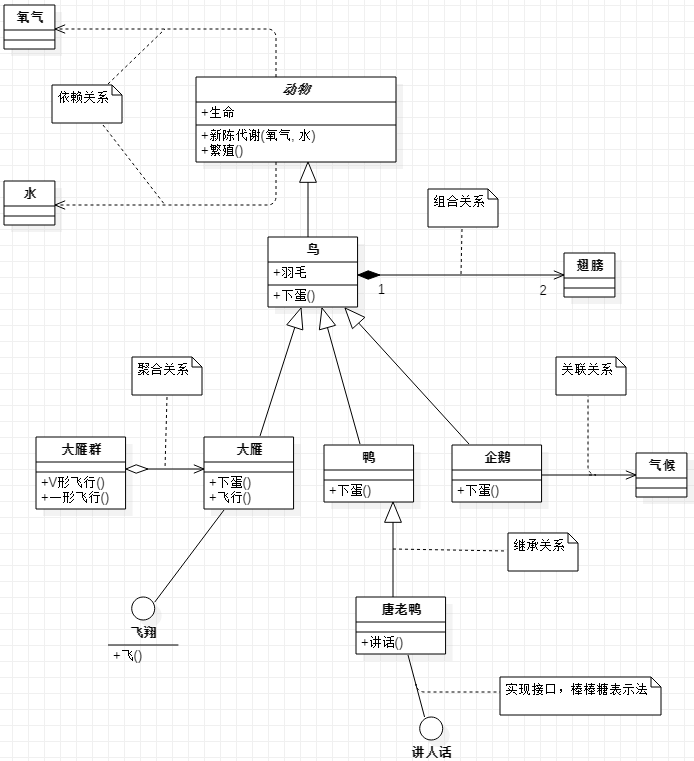
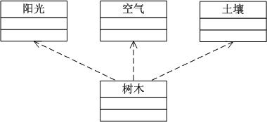
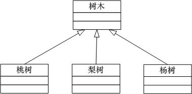
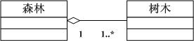
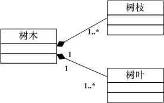
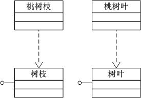

<<<<<<< HEAD
## 1.设计模式基础

### 1.1类图依赖关系

- 依赖（Dependency）关系

　　依赖关系是指两个或多个类之间的依存关系，如植物类依赖于土壤类。  依赖关系还可以再细分为5种类型，分别是绑定（Binding）依赖、实现（Realization）依赖、使用（Usage）依赖、抽象（Abstraction）依赖和授权（Permission）依赖。

　　依赖关系用虚线箭头来表示，箭头指向为依赖的方向。

- 泛化（Generalization）关系

　　简单的讲就是类之间的继承关系。在UML中，泛化关系用空心三角形+实线来表示，箭头指向为父类。

- 聚合（Association）关系

　　聚合关系是类之间的一种较弱的耦合关系，如一个字符串数组和一个字符串就是一种聚合关系。在UML中类图中，聚合关系用空心的菱形+实线箭头来表示，箭头指向为被聚合的类。

- 组合（Aggregation）关系

　　组合关系是类之间一种整体与部分之间的关系，如一只青蛙有四条腿，青蛙类与青蛙腿类之间的关系就是组合关系。在UML类图中，组合关系用实心的菱形+实线箭头来表示，箭头指向为被组合的类。

- 关联（Composition）关系

　　关联关系是类之间一种相互影响的关系，影响的方向就是关联的方向。在UML类图中，组合关系用实线箭头来表示。

- 实现（Realization）关系

　　一般来讲实现关系是针对类与接口之间的关系而言的。在UML类图中，实现关系用空心三角形+虚线来表示。

=======

>>>>>>> c8fd1c08c6fed0ac2a1ae4c1ed522e381aa812ea
