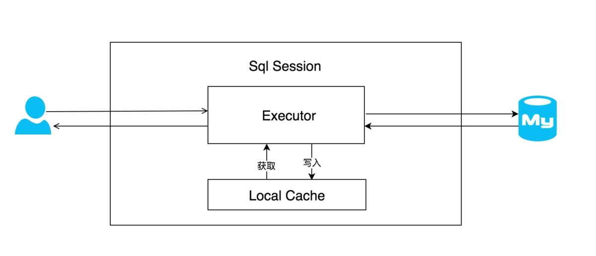
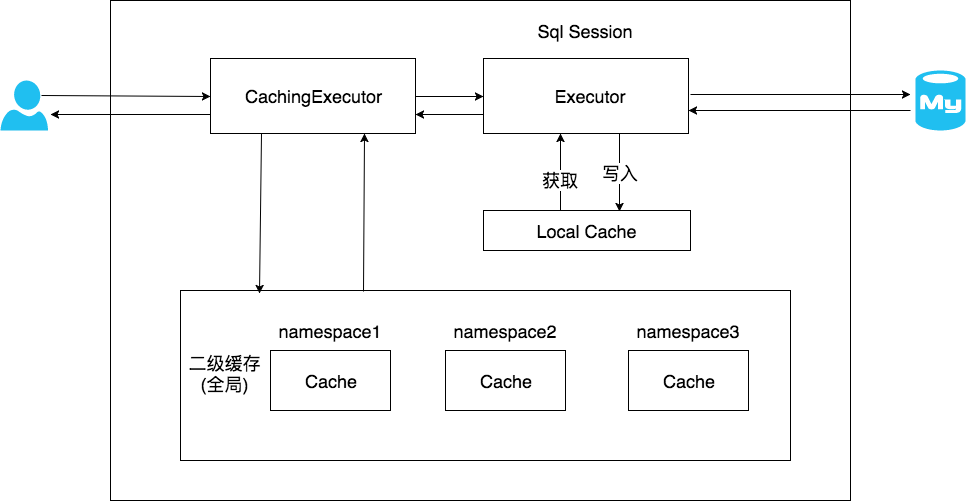
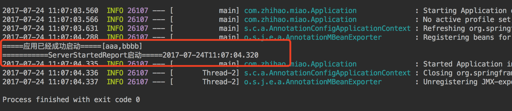

[TOC]

------


## 1.mysql中函的函数

### 1.1、IF()函数的使用

IF(expr1,expr2,expr3)，如果expr1的值为true，则返回expr2的值，如果expr1的值为false，则返回expr3的值。

```sql
SELECT IF(TRUE,'A','B');    -- 输出结果：A
SELECT IF(FALSE,'A','B');   -- 输出结果：B
```

### 1.2、IFNULL()函数的使用

IFNULL(expr1,expr2)，如果expr1的值为null，则返回expr2的值，如果expr1的值不为null，则返回expr1的值。

```sql
SELECT IFNULL(NULL,'B');    -- 输出结果：B
SELECT IFNULL('HELLO','B'); -- 输出结果：HELLO
```

### 1. 3、NULLIF()函数的使用

NULLIF(expr1,expr2)，如果expr1=expr2成立，那么返回值为null，否则返回值为expr1的值。

```sql
SELECT NULLIF('A','A');     -- 输出结果：null
SELECT NULLIF('A','B');     -- 输出结果：A
```

### 1. 4、ISNULL()函数的使用

ISNULL(expr)，如果expr的值为null，则返回1，如果expr1的值不为null，则返回0。

```sql
SELECT ISNULL(NULL);        -- 输出结果：1
SELECT ISNULL('HELLO');     -- 输出结果：0
```

###  1.5、时间与字符串的转化

- `DATE_FORMAT(expr,pattern)` //时间截取，返回字符串
  expr :时间字符串，日期字符串或者日期时间类型。
  对于截取年，月，日，时，分，秒返回的都是对应的字符串，因为时间日期类型mysql 本身就只提供了date,time ,datetime,timestamp,year这五种类型

  ```sql
  select date(now()),time('2018-04-19 11:10:11'),year(now()),to_days(now());
  2018-04-19        11:10:11                 2018      73716812
  ```

  ```sql
  select DATE_FORMAT(now(),'%Y%m%d');
  -- 20181101
  select DATE_FORMAT('2019-01-02','%Y-%m-%d')
  --2019-01-02
  1234
  ```

- Y 年，四位数字
- %y 年，后两位数字
- %m 月 ，数字[1-12]
- %d 日，月份里的第几天，两位数字[1-31]
- %H 小时，24进制 [0-23]
- %h 小时，12进制[0-11]
- %i 分钟 [0-59]
- %s | %S 秒 0-59

## 2. 文件路径适配linux和Windows系统

​	`System.getProperty("file.separator")`

## 3.nohup java -jar  xxxx.jar >logs.log

​	nohup 命令运行由Command参数和任何相关的Arg参数指定的命令，忽略所有挂断（SIGHUP）信号。在注销后使用 nohup 命令运行后台中的程序。要运行后台中的 nohup 命令，添加 & （ 表示“and”的符号）到命令的尾部。

​		如果不将 nohup 命令的输出[重定向](https://baike.sogou.com/lemma/ShowInnerLink.htm?lemmaId=73770898&ss_c=ssc.citiao.link)，输出将附加到当前目录的 nohup.out 文件中。如果当前目录的 nohup.out 文件不可写，输出重定向到 $HOME/nohup.out 文件中。如果没有文件能创建或打开以用于追加，那么 Command 参数指定的命令不可调用。如果标准错误是一个终端，那么把指定的命令写给标准错误的所有输出作为标准输出重定向到相同的文件描述符。

## 4. 使用MessageFormat格式化带占位符的字符串

```java
String str = "Hel{0}o {1}or{2}d!";
String str2 = java.text.MessageFormat.format(str,"l","W","l");//Hello World
```

​	也可以用String.format实现,但是当str比较复杂的时候会格式化出错

```java
String str = "Hel%so %sor%sd!";
String str2 = String.format(str,"l","W","l");//Hello World
```

## 5.项目标题栏中文乱码

```yml
spring:
	http:
		encoding: 
			charset: UTF-8
			force : true
			enable : true
```

## 6.创建一个线程安全、延迟加载的单例

```java
public class Singleton implement public class Singleton {
	private Singleton() {
		System.out.println("Singleton is create!");
	}
	// 静态内部类，延迟加载，并且解决了线程安全问题（实例的创建在类加载的时候完成，天生对多线程友好）
	private static class SingletonHelper {
		private static Singleton instance = new Singleton();
	}
	public static Singleton getInstance() {
		return SingletonHelper.instance;
	}
}

```

## 7.MyBatis的缓存

### 7.1一级缓存



​		只有在同一个sqlSession并且两次的查询sql和参数都完全相同的情况下才会使用一级缓存，可以通过在mapper中配置查询的方法：添加flushCache=true参数使这个查询语句的一级缓存失效。

​		 `任何的增删改语句都会使一级缓存失效。`

一级缓存失效的原因：

- 使用不同的SQLSession不会使用一级缓存
- 相同的SQLSession但是查询的条件不相同
- 相同的SQLSession，查询条件也相同，但是第二次查询的之前执行了更新语句（增删改）
- 手动刷新了缓存

### 7.2二级缓存



​		二级缓存存在于SqlSessionFactory 生命周期中。

​		在使用之前需要手动去配置开启，在application.yml文件中配置

```yml
mybatis: 
	configuration: 
		cache-enabled: true
```

​		之后配置mapper文件开启缓存

## 8.java中字符串截取方法

- 最常见的字符串截取方法是string的split（String regex）方法，可以通过正则表达式进行分割，功能强大，但是要进行简单的大字符串频繁截取操作时，不适用，性能太低。
- StringTokenizer是jdk提供的专门用于截取字符串的工具类，性能远高于split

```java
StringTokenizer st = new StringTokenizer(str,"分隔符");
for(int i = 0 ; i<st.countToken() ; i++){
    System.out.println(st.nextToken());
}
```

- 使用String自带的indexOf方法和subString（）方法结合是效率最高的方式

## 9.优化集合访问代码

### 9.1遍历集合时注意collection.size()

> 在遍历集合时for循环的控制条件里尽量少用collection.size（）

```java
for(int i = 0 ; i<collection.size();i++){}//少用，在每一次循环时候都会调用。siz方法
//直接用变量来接收size，不用在每次循环中去调用
int size = collection.size();
for(int i = 0 ; i<size ; i++){}
```

### 9.2省略相同的操作

### 9.3减少方法调用

### 9.4集合的遍历

​		集合遍历时可以使用for循环进行遍历，也可以使用迭代器进行遍历。基于数组实现的集合适合用for循环进行遍历，对于基于链表实现的集合使用迭代器遍历效率更高。

​		任何一个基于数组实现的集合都实现了RandomAccess接口，RandomAccess接口里面什么都没做。可以判断list instanceof RandomAccess接口来决定使用for遍历还是使用迭代器遍历.

## 10.NIO

> ​		与流式I/O不同，NIO时基于块的，它以块为基本单位处理数据，在NIO中，最为重要的两个组件时Buffer和Channel。缓冲是一块连续的内存块，，是NIO读写数据的中转地，通道表示缓冲数据的源头或目的地，用于向缓冲中写入数据，是访问缓冲的接口。
>
> ​	在读一个Channel的时候，需要先将数据读到对应的Buffer中，然后对Buffer进行读取。

- NIO进行文件复制的例子

```java
import java.io.FileInputStream;
import java.io.FileOutputStream;
import java.nio.ByteBuffer;
import java.nio.channels.FileChannel;
public class TestNIO {
	public static void main(String[] args) throws Exception {
		nioCopyFile("C:\\Users\\jjli.Ajay\\Desktop\\BZ.rar", "C:\\Users\\jjli.Ajay\\Desktop\\BZ222.rar");
	}
	public static void nioCopyFile(String resourse,String to) throws Exception {
		FileInputStream fis = new FileInputStream(resourse);
		FileOutputStream fos = new FileOutputStream(to);
		FileChannel readChannel = fis.getChannel();//读文件通道
		FileChannel writeChannel = fos.getChannel();//写文件通道
		ByteBuffer buffer = ByteBuffer.allocate(1024);//缓冲
		while(true) {
			buffer.clear();//清除缓冲区
			int len = readChannel.read(buffer);//通过channel通道读文件到缓冲
			if(len==-1) {
				break;
			}
			buffer.flip();//重置缓冲区，position为0，limit（实际大小）为之前的position，用于写文件
			writeChannel.write(buffer);//将缓冲区数据通过channel写入目标文件
		}
		readChannel.close();
		writeChannel.close();
		fos.close();
		fis.close();
	}
}
```

### 10.1Buffer的相关操作

- Buffer的创建

  `ByteBuffer Buffer= ByteBuffer.allocate(1024)` ----从堆中分配指定大小的buffer

  

  `byte array[] = new byte[1024];`

  `ByteBuffer buffer = ByteBuffer.wrap(array);` ----从已有的数组中创建

- 重置和清空缓冲区

|                     | rewind()                     | clear()                         | flip()           |
| ------------------- | ---------------------------- | ------------------------------- | ---------------- |
| position当前位置    | 置零                         | 置零                            | 置零             |
| mark标记            | 清空                         | 清空                            | 清空             |
| limit缓冲区实际上限 | 未改动                       | 设置为capacity（总容量>=limit） | 设置为position   |
| 作用                | 为读取Buffer中有效数据做准备 | 为重新写入Buffer做准备          | 在读写切换时调用 |

- 标志缓冲区

  mark()用于记录当前的位置，reset()函数用于恢复到mark所在的位置

- 复制缓冲区

  `public ByteBuffer duplicate();`

  ​		复制后的缓冲区和原缓冲区共享相同的内存数据（向原缓冲区添加数据，在新的缓冲区也可以看见），但是两者又独立各自维护了自己的position，limit，mark。

- 缓冲区分片`slice`

  ```java
  byte arr[] = new byte[]{123,234,456,....};
  ByteBuffer b = ByteBuffer.wrap(arr);
  b.position(1);
  b.limit(3);
  ByteBuffer subBuffer = b.slice();//截取position到limit，生成子缓冲区
  ```

  ​	对于子缓冲区的处理，父缓冲区也能够看大改动。

- 只读缓冲区

  `buffer.asReadOnlyBuffer()` ----创建只读缓冲区

  ​		特点：相当于对缓冲区的复制，但是不同于缓冲区复制的是：对于只读缓冲区，原缓冲区的改动对其可见，但是，不能对只读缓冲区进行修改，保护了原缓冲区的数据。


## 11. java中的路径问题

### 11.1 java项目获取项目绝对路径

```java
public class PathTest {
	public String p1 = this.getClass().getResource("/").getPath();
	public String p2 = this.getClass().getResource("").getPath();
	public String p3 = System.getProperty("user.dir");
	public String p6 = System.getProperty("java.class.path");
	public static void main(String[] args) throws IOException {
		PathTest pt = new PathTest();
		// 第一种
		System.out.println(pt.p1);
		// /C:/EclipseWorkspace/Add_TOC/target/test-classes/

		// 第二种
		System.out.println(pt.p2);
		// /C:/EclipseWorkspace/Add_TOC/target/test-classes/cn/com/ajay/test/

		// 第三种
		System.out.println(pt.p3);
		// C:\EclipseWorkspace\Add_TOC

		// 第四种
		File directory = new File("");// 参数为空
		String p4 = directory.getCanonicalPath();
		System.out.println(p4);
		// C:\EclipseWorkspace\Add_TOC

		// 第五种
		String p5 = Thread.currentThread().getContextClassLoader().getResource("").getPath();
		System.out.println(p5);
		// /C:/EclipseWorkspace/Add_TOC/target/test-classes/

		// 第六种
		System.out.println(pt.p6);
		// C:\EclipseWorkspace\Add_TOC\target\test-classes;C:\EclipseWorkspace\Add_TOC\target\classes;C:\Users\jjli.Ajay\.m2\repository\com\github\houbb\markdown-toc\1.0.2\markdown-toc-1.0.2.jar	
	}
}

```

### 11.2 javaWEB 项目获取绝对路径

```java
//项目的根路径：E:\apache-tomcat-7.0.57\webapps\test
System.out.println(request.getSession().getServletContext().getRealPath(""));

//当前的请求路径：/test/login.action
System.out.println(request.getRequestURI());

//项目的部署名称：/test
System.out.println(request.getContextPath());

//classes的文件根路径：/E:/apache-tomcat-7.0.57/webapps/test/WEB-INF/classes/
System.out.println(this.getClass().getResource("/").getPath());
```

### 11.3 java的文件路径分隔符

```java
System.getProperty("file.separator");
System.out.println(File.separator);
```


## 12. SpringBoot读取配置文件

### 12.1 SpringBoot 的全局配置文件application

 	SpringBoot使用一个application.yml/application.properties文件作为SpringBoot的全局配置文件。application配置文件的两种格式同时存在于相同的目录时，properties文件的优先级高于yml。

### 12.2 全局配置文件的目录

​		SpringBoot的全局配置文件允许放在多种路径下，不同的路径，读取的优先级不同

- 可放置的目录（优先级从高到低）

```java
/*
./config/ (当前项目路径config目录下);
./ (当前项目路径下);
classpath:/config/ (类路径config目录下);
classpath:/ (类路径config下)
*/
下图所示。最终读取到的结果是：7777
```


### 12.3全局配置文件读取

- @ConfigurationProperties注解进行批量注入

> 可以使用@ConfigurationProperties注解对一个对象的多个属性批量注入。

```java
@Component
@ConfigurationProperties(prefix = "user")
public class User{
    private String username;
    private String password;
}
```

- @Value注解方式

```java
public class InfoConfig {
   @Value("${info.address}")
   private String address;
 
   @Value("${info.company}")
   private String company;
 
   @Value("${info.degree}")
   private String degree;
}
```

### 12.4 自定义properties文件的读取

- @PropertySource+@Value注解读取

```java
@Component
@PropertySource(value = { "config/db-config.properties" })
public class DBConfig1 {
   @Value("${db.username}")
   private String username;
   @Value("${db.password}")
   private String password;
}
```

- @PropertySource+@ConfigurationProperties注解读取

```java
@Component
@ConfigurationProperties(prefix = "db")
@PropertySource(value = { "config/db-config.properties" })
public class DBConfig2 {
   private String username;
   private String password;
}
```

**注意：**

- 只能读取properties格式的文件，无法读取yml
- PropertySource可以配置多个value，在读取配置文件时，后面的会覆盖前面的

### 12.5 使用Environment读取配置文件

使用方式：

```java
@Autowired
private Environment environment;
public void getProperty() {
  environment.getProperty("jdbc.driverClassName");
}
```

类似使用注解的方式如下：

```java
@Configuration
@PropertySource("classpath:db.properties")
public class TestProperties {
	@Autowired
	private Environment env;
	public void getProperty() 
		environment.getProperty("jdbc.driverClassName");
	}
}
```

## 13. 普通java项目maven打包

```xml
<plugins>
    <plugin>
        <artifactId>maven-compiler-plugin</artifactId>
        <version>3.1</version>
        <configuration>
        	<source>1.7</source>
            <target>1.7</target>
            <encoding>UTF-8</encoding>
        </configuration>
    </plugin>
    <!-- 打包为jar -->
    <plugin>
    	<groupId>org.apache.maven.plugins</groupId>
        <artifactId>maven-jar-plugin</artifactId>
        <configuration>
       		<!-- 不打包资源文件 -->
            <excludes>
            	<exclude>*.**</exclude>
                <exclude>*/*.xml</exclude>
            </excludes>
            <archive>
            	<manifest>
                	<addClasspath>false</addClasspath>
                    <!-- MANIFEST.MF的Class-Path加入lib前缀-->
                    <classpathPrefix>lib</classpathPrefix>
                    <!-- jar包不包含唯一版本标识-->
                    <useUniqueVersions>false</useUniqueVersions>
                    <!--指定入口类-->
                    <mainClass>com.wind.Main</mainClass>
                </manifest>
                <manifestEntries>
                	<!-- MANIFEST.MF中Class-Path加入资源文件目录-->
                    <Class-Path>./resources/</Class-Path>
                </manifestEntries>
            </archive>
            <outputDirectory>${project.build.directory}</outputDirectory>
        </configuration>
    </plugin>
    <!-- 拷贝依赖 copy-dependencies-->
    <plugin>
    	<groupId>org.apache.maven.plugins</groupId>
        <artifactId>maven-dependency-plugin</artifactId>
        <executions>
        	<execution>
            	<id>copy-dependencies</id>
                <phase>package</phase>
                <goals>
                	<goal>copy-dependencies</goal>
                </goals>
                <configuration>
                	<outputDirectory>${project.build,directory}/lib/</outputDirectory>             
                </configuration>
            </execution>
        </executions>        
    </plugin>
    <!--拷贝资源文件-->
    <plugin>
    	<artifacId>maven-resources-plugin</artifacId>
        <executions>
        	<execution>
            	<id>copy-resources</id>
                <phase>package</phase>
                <goals>
                	<goal>copy-resources</goal>                    
                </goals>
                <configuration>
                	<resources>
                        <resource>
                        	<directory>src/main/resources</directory>
                        </resource>           	
                    </resources>
                    <outputDirectory>${project.build.directory}/resources</outputDirectory>
                </configuration>
            </execution>
        </executions>
    </plugin>
    <!-- SpringBoot repackage 依赖maven-jar-plugin打的jar包，重新打包成Spring boot的jar包-->
    <plugin>
    	<groupId>org.springframework.boot</groupId>
        <artifactId>spting-boot-maven-plugin</artifactId>
        <configuration>
        	<!-- 重写包含依赖，包含不存在的依赖，jar里没有pom里的依赖-->
            <layout>ZIP</layout>
            <!-- 使用外部配置文件，jar包里没有配置文件-->
            <addResources>true</addResources>
            <outputDireectory>${project.build.directory}</outputDireectory>        
        </configuration>
        <executions>
        	<execution>
            	<goals>
                	<goal>repackage</goal>
                </goals>
                <configuration>
                	<!--配置jar包特殊标识配置后，保留源文件，生成*-run.jar-->
                    <!--配置jar包特殊标识不配置，源文件命名为*。jar.original，生成*.jar-->
                    <!-- <classifier>run</classifier> -->
                </configuration>
            </execution>
        </executions>
    </plugin>
    <!-- install打包时跳过测试-->
    <plugin>
        <groupId>org.apache.maven.plugins</groupId>
        <artifactId>maven-suregire-plugin</artifactId>
        <configuration>
        	<skip>true</skip>
        </configuration>
    </plugin>
</plugins>
```

## 14.SpringBoot 的CommandLineRunner和ApplicationRunner接口

> CommandLineRunner、ApplicationRunner 接口是在容器启动成功后的最后一步回调（类似开机自启动）。

​	多个CommandLineRunner可以被同时执行在同一个spring上下文中并且执行顺序是以order注解的参数顺序一致。

``` java
import org.springframework.boot.CommandLineRunner;
import org.springframework.core.annotation.Order;
import org.springframework.stereotype.Component;

import java.time.LocalDateTime;

@Order(2)
@Component
public class ServerStartedReport implements CommandLineRunner{
    @Override
    public void run(String... args) throws Exception {
        System.out.println("===========ServerStartedReport启动====="+ LocalDateTime.now());
    }
}
```

```java
import org.springframework.boot.CommandLineRunner;
import org.springframework.core.annotation.Order;
import org.springframework.stereotype.Component;

import java.util.Arrays;

@Order(1)
@Component
public class ServerSuccessReport implements CommandLineRunner{
    @Override
    public void run(String... args) throws Exception {
        System.out.println("=====应用已经成功启动====="+ Arrays.asList(args));
    }
}
```



​		二者的官方javadoc一样，区别在于接收的参数不一样。CommandLineRunner的参数是最原始的参数，没有做任何处理。ApplicationRunner的参数是ApplicationArguments，是对原始参数做了进一步的封装。

​		ApplicationArguments是对参数（main方法）做了进一步的处理，可以解析--name=value的，我们就可以通过name来获取value（而CommandLineRunner只是获取--name=value）

## 15.SpringBoot项目启动完成后统一启动多个插件（Redis、MQ等）方案

### 15.1 boot包下自定义StartFlower接口

```java
public interface StartFlower{
    public void start() throws Exception;
}
```

### 15.2 每个插件实现StartFlower接口

启动详细工作放到start方法中进行

### 15.3 FinishFlower实现StartFlower

用于其他插件启动之后的操作，打印日志等工作

### 15.4 StartChainEntrance类统一启动所有插件

```java
@Compoent
public class StartChainEntrance implements CommandLineRunner{
    private List<StartFlower> flowers = new ArrayList<>();
    
    public void addStarter(StartFlower stater){
        flowers.add(stater);
    }
    //启动各个环节
    public void start() throws Exception{
        for(StartFlower s : flowers){
           	s.start();
        }
    }
    
    @Override
    public void run(String... args)throws Exception{
    	StartFlower s1 = new S1Starter();
        StartFlower s2 = new S2Starter();
        StartFlower finish = new FinishFlower();
        this.addStarter(s1);
        this.addStarter(s2);
        this.addStarter(finish);
        
        this.start();
    }     
}
```


